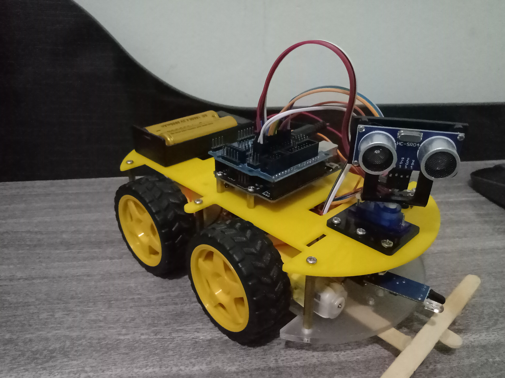
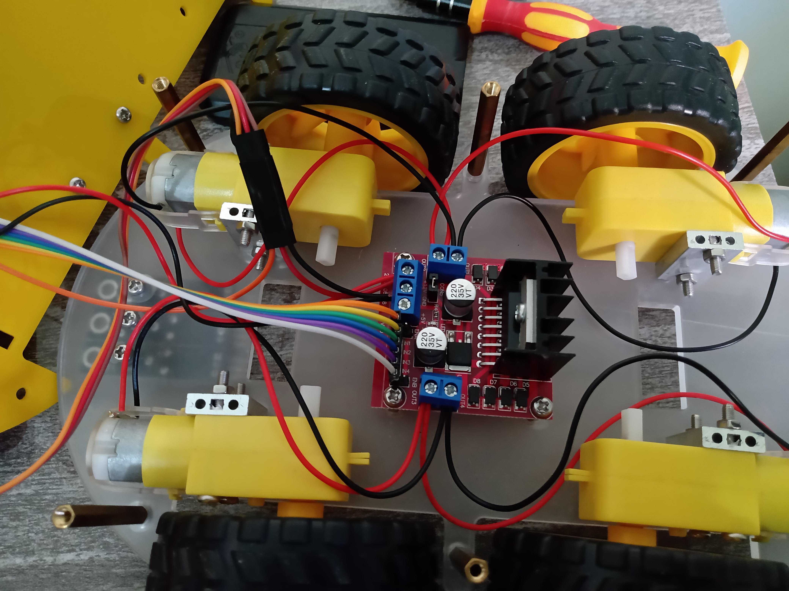
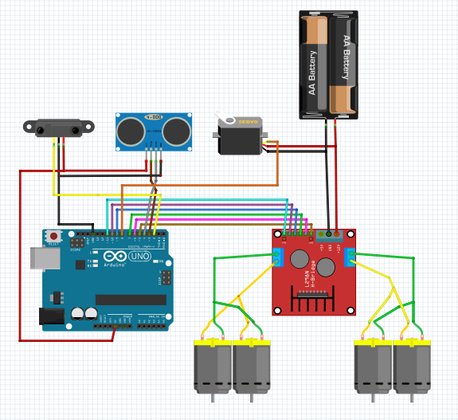

<h1> Carrinho que desvia de Obstáculos

 

<h2> Componentes Utilizados: </h2>
<ul>
<li>
<b>1 x Arduino Uno:</b> é o "cérebro" do carro. Uma placa com pinos de entrada e saída programada para tomar decisões com base em valores lidos por sensores;
</li> 
<li>
<b>1 x Sensor Ultrassônico:</b> através de seus pinos "Trig" e "Echo", são emitidas ondas ultrassônicas que permitem aferir distâncias entre 2cm e 4m;
</li>
<li>
<b>1 x Sensor de Obstáculos Infravermelho:</b> sensor com um único pino de sinal, que comuta seu estado quando detecta um obstáculo. A distância mínia para comutação pode ser ajustada por um potenciômetro presente no sensor;
</li>
<li>
<b>1 x Servo Motor:</b> motor que varia seu ângulo de 0 a 179 graus. Serve de suporte ao sensor ultrassônico para que o carro "olhe para os lados" quando detectar uma possível colisão; 
 </li>
<li>
<b>4 x Motores DC:</b> micro motores com caixas de redução que são acoplados às rodas do carro;
</li>
<li>
<b>Ponte H:</b> módulo que permite o controle da velocidade e do sentido da rotação dos motores, por PWM e por polarização direta e reversa, respectivamente;
</li>
<li>
<b>2 x Pilhas Recarregáveis de 3.7V:</b> são a fonte de energia elétrica do circuito de controle (Arduino e sensores) e do circuito de força (servo motor e micro motores).
</li>
</ul>

 

 
<h2> Diagrama com as Conexões: </h2>

Não há nenhum segredo quanto às conexões. Deve-se apenas atentar para que os pinos enebleA e enableB da ponte H sejam conectados em portas PWM do Arduino. Essas potas devem ser diferentes das 9 e 10, visto que os comandos analogWrite() ficam inabilitados nessas portas quando a biblioteca para controle do Servo Motor está em uso. 

<h2> Link para vídeo do carrinho funcionando: 
 
<a href="https://www.youtube.com/watch?v=SkatsO9j9xM" target="_blank"> https://www.youtube.com/watch?v=SkatsO9j9xM </a></h2>

