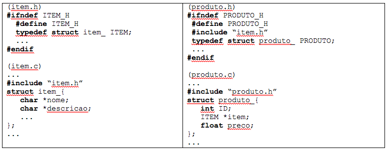
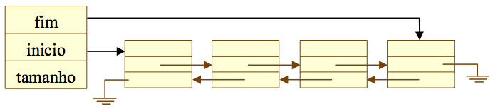

# Prova 1

## Questão 1

Sejam os TADs Item e Produto como definido abaixo. Desenvolva uma função void atualiza `(char *n_nome, int ID, LISTA *l);` para atualizar o nome de um produto, presente na lista `L` de produtos, cujo identificador é `ID`. Desenvolva a função justificando onde ela deve ser implementada (em que arquivo .c?). Se necessário, use funções auxiliares, sempre indicando e justificando como desenvolver as alterações que julgar pertinentes nos TAD. Se necessário, você pode supor a existência - e usar - de uma função `void copy_nome (char *n1, char *n2);` que copia a string n1 para a string n2.



### Resposta

A função "atualiza" diz respeito ao TAD produto, pois necessita de um código(ID) para que a alteração no nome de determinado produto seja feita. Entretanto, o acesso "direto" aos dados do TAD item (nome e descrição) pode ser feito apenas no arquivo em que a estrutura item_ é declarada, pois, como essa informação fica oculta nos demais arquivos, não há possibilidade de alteração.
Dessa forma, a função "atualiza" deve ser implementada no TAD produto e o TAD item deve receber mais uma função: "alterarNome(ITEM *item, char *n_nome)". Assim:

```C
void atualiza(char *n_nome, int ID, LISTA *l){

    if(lista == NULL) return;

    PRODUTO *produtoBuscado = produtoBusca(l, ID);

    if(produtoBuscado != NULL)
        alterarNome(produtoBuscado->item, n_nome);
}
```

```C
void alterarNome(ITEM *item, char *n_nome){

    if(item != NULL && n_nome != NULL)
        copy_nome(n_nome, item->nome);
}
```

## Questão 2

Você acaba de ser contratado pelo Serasa - São Carlos (Experian). Sua missão atual: desenvolver o cadastro de inadimplentes. A estrutura de dados, por razões históricas, deve ser uma Lista. Sabe-se que: 

- desempenho é crítico;
- memória é crítica; 
- o volume de consultas é alto;
- o volume diário de pessoas inseridas e removidas do cadastro é alto.

Dado esse contexto, como você implementaria essa Estrutura de Dados para que seja o mais eficaz e eficiente possível? Justifique sua resposta em termos de eficiência, eficácia, complexidade algorítmica, estratégias de implementação da estrutura de dados e das operações do TAD lista.

### Resposta

Considerei *n* o número de pessoas inseridas na lista.

Sabendo que a memória é crítica, a melhor alternativa seria alocá-la dinamicamente (em tempo de execução). A complexidade de memória é sempre de *O(n)* e só são alocados espaços necessários para manter o cadastro dos inadimplentes atuais.

Considerando que o número de pessoas no sistema não é fixo, não seria muito interessante escolher uma lista sequencial, uma vez que seu tamanho seria limitado e, em algum momento, o número de pessoas cadastradas poderia extrapolar o tamanho da lista. Mesmo usando a função `realloc()` para realocar a lista sequencial não seria muito vantajoso, pois o sistema operacional poderia ter que fazer algumas operações extras para conseguir retornar um ponteiro para uma região livre de memória sequencial caso um grande tamanho seja requisitado.

Pensando nisso, eu optaria por uma lista simplesmente encadeada circular e com nó sentinela, de forma que a lista fique sempre ordenada.

A lista seria simplesmente encadeada e não duplamente encadeada pois nesse caso não há uma grande necessidade de armazenar um ponteiro para cada nó anterior e, portanto, seriam economizados 8 bytes de memória por nó.

A lista seria circular com nó sentinela pois as operações que envolvem busca de inadimplentes seriam razoavelmente mais eficientes: enquanto na busca com lista simplesmente encadeada devemos verificar se o próximo nó é não nulo e se o id atual é igual ao que estamos buscando, na lista encadeada circular com sentinela podemos inicialmente atribuir o id buscado ao sentinela e apenas verificar se o id atual é igual ao que estamos buscando e, por fim, verificar se ele é diferente do sentinela. No primeiro caso temos *(2c)n* e no segundo *(c)n + c*, em que *c* é o custo de uma comparação. Ambas possuim complexidade *O(n)* mas a segunda forma é ligeiramente mais eficiente.

A lista seria ordenada pois, no momento da busca, poderíamos verificar se o id que estou buscando é menor que o atual (ou seja, se o id não existe já posso retornar a busca como NULL sem precisar  iterar pelo restante da lista fazendo comparações desnecessárias).

Assim, tanto a inserção, quanto a remoção, quanto a busca teriam complexidade *O(n)*.


## Questão 3

Desenvolva uma função recursiva void `pilha_inverter(PILHA *P);` para inverter, do modo mais eficiente possível, a posição dos elementos de uma pilha dinâmica encadeada P. O resultado precisa ser dado na pilha P. Considere que a pilha guarda elementos do tipo `int`. Você pode usar funções auxiliares se necessário (escondidas do usuário). A resposta deve seguir as interfaces dos TADs fornecidos. Submeta como reposta apenas o código da função. 

```C
void pilha_inserir_base(PILHA *pilha, ITEM *item){ // método privado

    NO *noAtual = pilha->topo;

    if(pilha_tamanho(pilha) == 0)
        pilha->topo = pilha_criar_no(item);
    else{
        while(noAtual->proximo != NULL)
            noAtual = noAtual->proximo;
        noAtual->proximo = pilha_criar_no(item);
    }

    pilha->tamanho += 1;
}
```

```C
void pilha_inverter_rec(PILHA *original){ // método privado

    if(original->topo == NULL){
        original->tamanho = 0;
        return;
    }

    // Ida da recursão: Desempilhando os itens da pilha original e empilhando na CallStack
    NO *noAtual = original->topo;
    ITEM *itemAtual = noAtual->item;
    original->topo = noAtual->proximo;
    free(noAtual);
    
    pilha_inverter_rec(original);
    
    // Volta da recursão: Empilhando os itens da CallStack na base da pilha original
    pilha_inserir_base(original, itemAtual);
}
```

```C
void pilha_inverter(PILHA *pilha){ // método público

    if(pilha != NULL && pilha_tamanho(pilha) > 0)
        return(pilha_inverter_rec(pilha));
}
```

## Questão 4

Uma lista duplamente encadeada pode ser esquematizada como na figura abaixo:



Suponha que cada nó da lista guarde como item um número inteiro apenas. Implemente uma função para remover um nó em qualquer posição da lista. Defina os tipos de dados (e structs correspondentes) para esta lista.

```C
struct no_{
    ITEM *item;
    NO *anterior;
    NO *proximo;
};
```

```C
struct lista_{
    NO *inicio;
    NO *fim;
    int tamanho;
};
```

```C
lista_busca_no(LISTA *lista, int chave){ //retorna o no do item correspondente à chave

    NO *n = lista->inicio;

    while(n != NULL){
        if(item_get_chave(n->item) == chave)
            return n;
        n = n->proximo;
    }

    return NULL;
}
```

```C
bool lista_remover_no(LISTA *lista, int chave){

    if(lista == NULL || lista-> tamanho == 0)
        return False;

    NO *no = lista_busca_no(lista, chave);

    if(NO != NULL){
        if(no == lista->inicio)
            lista->inicio = no->proximo;
        else 
            no->anterior->proximo = no->proximo;
        if(no == lista->fim)
            lista->fim = no->anterior;
        else
            no->proximo->anterior = no->anterior;
        no->anterior = NULL;
        no->proximo = NULL;
        free(no);
        lista->tamanho -= 1;
        return(True);
    }

    return(False);
}
```
