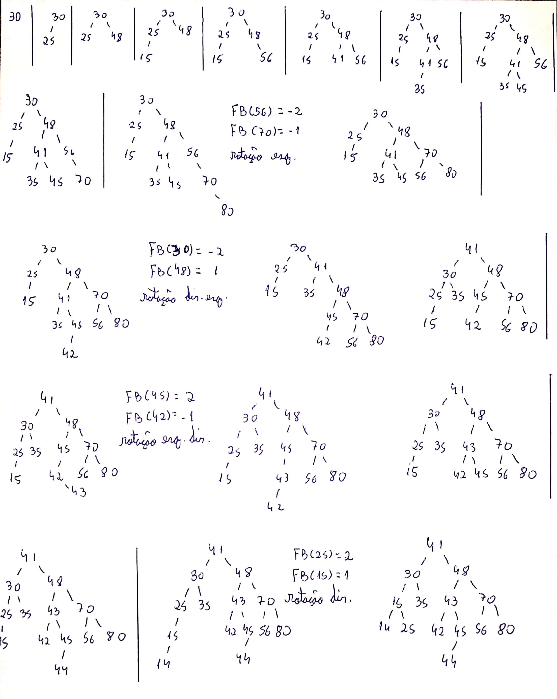

# Prova 2

## Questão 1

Escreva uma função, em C, recursiva ou não, que determina se uma árvore binária é perfeitamente balanceada. A função deve possui o seguinte protótipo: `int determina(NO *raiz);` em que *raiz* é um ponteiro para uma estrutura do tipo:

```C
typedef struct no{
    no *esq;
    no *dir;
    int valor;
}NO;
```

 No TAD árvore (nesse exemplo considerando uma ABB - Árvore Binária de Busca), é definida a função `arvore_perfeitamente_balanceada(ABB *arvore)`, em que o usuário passa uma árvore para que seja feita a verificação. De que forma a função pode ser implementada no arquivo .c?

 ### Resposta

Podemos criar uma macro `ERRO` para retornar um código quando a operação falhar. Assim:

```C
    #define ERRO -999
```

Pode ser implementada a seguinte função auxiliar privada no arquivo .c:

 ```C
    int arvore_obter_numero_subarvores(NO *raiz){

        if(raiz == NULL)
            return(0);
        
        return(arvore_obter_numero_subarvores(raiz->filhoEsquerda) + 
               arvore_obter_numero_subarvores(raiz->filhoDireita) + 1);
    }
 ```

E a função `arvore_perfeitamente_balanceada(ABB *arvore)` teria o seguinte escopo:


 ```C
    int arvore_perfeitamente_balanceada(ABB *arvore){
        
        if(arvore != NULL)
            return(determina(arvore->raiz));
        
        return(ERRO);
    }
 ```

 A função `determina` pode ser implementada dessa forma:

 ```C
    int determina(NO *raiz){
        
        int perfBalanceada = 1;
        determina_rec(raiz, &perfBalanceada); 
        return(perfBalanceada);
    }

 ```

`determina_rec(NO *raiz, int *perfBalanceada)` percorre toda a arvore. Se for detectado uma quebra na condição de perfeito balanceamento, a variável inteira `perfBalanceada` é zerada por referência:

```C
    void determina_rec(NO *raiz, int *balanceada){

        if(raiz != NULL && *balanceada != 0){
            if(abs(arvore_obter_numero_subarvores(raiz->esquerda) - 
               arvore_obter_numero_subarvores(raiz->direita)) > 1){
                    *balanceada = 0;
            }
            determina_rec(raiz->esquerda, balanceada);
            determina_rec(raiz->direita, balanceada);
        }
    }
```

## Questão 2

Sobre deques, responda as questões abaixo:

a) Como implementar uma DEQUE para que as operações de inserção e remoção tenham um custo computacional *O(1)*?  
b) De acordo com sua resposta no item a), implemente uma função para remover itens de uma DEQUE. Não esqueça de definir os tipos de dados (as structs) necessários.

### Resposta

Para que a inserção e a remoção tenham um custo computacional *O(1)*, a melhor alternativa é implementar a deque como uma lista circular, seja ela sequencial ou encadeada. Em ambos os casos, basta reajustar os valores das variáveis `início` e `fim` da deque para que as inserções e remoções sejam feitas (além da alocação e desalocação de memória, caso o TAD utilize a memória Heap).

Estruturas e funções para remoção de itens de uma deque circular sequencial:

```C
    #define bool char
    #define True 1
    #define False 0

    typedef struct deque_ DEQUE;
```

```C
    #define TAM_MAX 100 // valor arbitrário para o tamanho máximo
```

```C
    struct deque_{
        ITEM *itens[TAM_MAX];
        int inicio;
        int fim;
        int tamanho;
    };
```

```C
    bool deque_remover_inicio(DEQUE *deque){

        if(deque != NULL && !deque_vazia(deque)){
            item_apagar(&deque->itens[deque->inicio]);
            deque->inicio = (deque->inicio + 1) % TAM_MAX;
            deque->tamanho -= 1;
            return(True);
        }

        return(False);
    }
```

```C
bool deque_remover_fim(DEQUE *deque){

    if(deque != NULL && !deque_vazia(deque)){
        deque->fim = (deque->fim - 1 + TAM_MAX) % TAM_MAX;
        item_apagar(&deque->itens[deque->fim]);
        deque->tamanho -= 1;
        return(True);
    }

    return(False);
}
```

## Questão 3

Dada a árvore AVL abaixo, pede-se:


a) Faça as inserções, por ordem, das seguintes chaves: 70, 80, 42, 43, 44, 14;  
b) A partir da árvore gerada em a), faça, pela ordem, a remoção dos nós com chaves 25 e 41.

Responda a questão em um papel. Tire uma foto de cada resposta (a e b), faça um .zip com as fotos e faça upload do .zip.

### Resposta




## Questão 4

Escreva uma função, em C, que decida se um vetor numérico de tamanho *n*, dado como entrada, é ou não uma heap máxima.

### Resposta

A função retorna 1 caso o vetor seja uma heap máxima ou 0 caso seja uma heap mínima:

```C
    int vetor_eh_heap_max(int *vetor, int n){

        /* o último elento do vetor está no índice n - 1 e o índice do seu pai é ((n-1)-1) / 2 = (n - 2) / 2 */

        int ultimoPai = (n - 2) / 2;

        for(int i = 0; i <= ultimoPai; i++){
            int chavePai = vetor[i];
            int filhoEsquerda = 2 * i + 1;
            int filhoDireita = 2 * i + 2;
            if(vetor[filhoEsquerda] > chavePai || vetor[filhoDireita] > chavePai)
                return(0);
        }

        return(1);
    }
``` 

## Questão 5

Dada uma árvore binária com mais de 3 nós, é possível que um percurso pré-ordem e um percurso em-ordem visitem os nós na mesma ordem? Se não, justifique. Se sim, dê um exemplo.

### Resposta

Sim, se a árvore estiver degenerada a uma lista ligada pendendo para a direita, os percursos pré-ordem e em-ordem apresentarão os mesmos resultados, uma vez que as sub-árvores à esquerda serão ignoradas na impressão (pois são nulas), restando apenas as chamadas de impressão para a raiz atual seguida da raiz da sub-árvore à direita.
