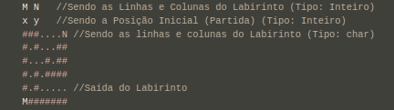
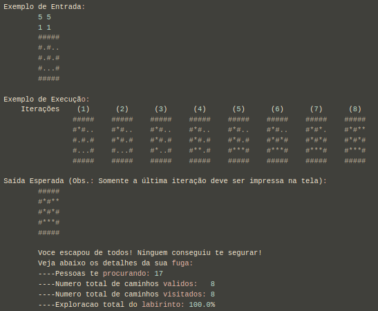

# Revisão de Alocação Dinâmica, Recursão e Arquivos


## Descrição

Um parente seu estava te procurando para que você consertasse o seu celular que não estava enviando correntes no "zap".

Embora você sempre explique que cursar Ciência da Computação não é isso, a pessoa não entende e ainda espalha seus serviços para toda a vizinhança, dizendo que você faz bem rápido e de graça.

Você está prestes a ser encontrado e obrigado a realizar tal tarefa. Mas antes que isso aconteça use seus conhecimentos para escapar!

Você está preso em um labirinto, só que ao invés de paredes são seus primos, tios, avós e vizinhos desejando seus serviços.

Corra o mais rápido que puder e não seja pego!

Em cada caso de teste você receberá um arquivo de texto contendo o labirinto, formatado da seguinte forma:


Você deverá:

* Organizar todos os trechos de código solicitados em funções;
* Ler o labirinto de um arquivo de texto;
    Leia da entrada padrão o nome do arquivo e o abra em seguida para leitura; 
* Alocar dinamicamente a memória para o labirinto;
* Percorrer o labirinto a partir de uma posição inicial p(x,y) de maneira recursiva. Respeite a ordem de busca (Cima, Direita, Baixo, Esquerda); 
* Marcar o seu caminho no labirinto com um caractere asterisco ('*');
* Ao encontrar a saída, você deve imprimir o labirinto com o seu percurso realizado;

Ao percorrer o labirinto, calcule:
```
    int npessoas = A quantidade de pessoas (Somar todos os '#');
    int caminhos = A quantidade de caminhos disponíveis (Somar todos os '.' no início);
    int visitados = A quantidade percorrida até encontrar a saída (Somar todos os '*' no final);
    double exploracao = O percentual de exploração do labirinto até encontrar a saída;
```

Imprima os resultados obtidos no passo (6) da seguinte forma:
```C
    printf("\nVoce escapou de todos! Ninguem conseguiu te segurar!\n");
    printf("Veja abaixo os detalhes da sua fuga:\n");
    printf("----Pessoas te procurando: %d\n", npessoas);
    printf("----Numero total de caminhos validos: %d\n", caminhos);
    printf("----Numero total de caminhos visitados: %d\n", visitados);
    printf("----Exploracao total do labirinto: %.1lf%%\n", exploracao); 
```

### Entrada e Saída:  

