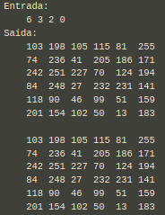
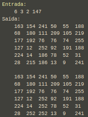
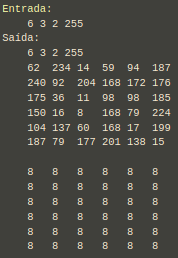

# Gerando Imagens Digitais

## Descrição

1) Leia os valores N, x, y e T da entrada padrão e inicialize a semente aleatória com o valor T.
2) Aloque dinamicamente uma matriz N x N com números aleatórios entre 0 e 255.
3) Desenvolva uma função recursiva a qual inicia num pixel informado pelo usuário (x,y).
3.1) O valor iniciado aleatoriamente na posição (x,y) será chamado de p.
3.2) Faça uma busca recursiva explorando sempre os 4 vizinhos da posição atual (cima, direita, baixo, esquerda), e, caso o pixel vizinho v seja diferente de p dentro de um intervalo m, modifique o valor de v inserindo p em seu lugar.
3.3) O valor de m é calculado desta forma: Se |p - v| <= T, v receberá o valor de p.
4) Imprimir na saída padrão a matriz inicial seguida da matriz resultante; O formato da impressão é usando uma tabulação entre os números, ou seja: printf("%d\t", img[i][j]);
5) Criar 2 arquivos no formato .pgm, os quais representarão respectivamente a imagem inicial (Aleatória) e a imagem final (Modificada Recursivamente). Mais detalhes da formatação deste arquivo .pgm podem ser vistos em: https://en.wikipedia.org/wiki/Netpbm

Critérios de parada:

* Quando a borda da imagem for atingida;
* Quando não houver mais vizinhos similares, ou seja, quando m > T;
* Quando v já possuir um valor igual a p, ou seja (v == p);

### Exemplo 1

Quando T for menor ou igual ao valor minimo (0) nenhum valor da matriz será modificado.

### Exemplo 2

Valores intermediários são modificados de acordo com o valor de m definido acima.

### Exemplo 3

Quando T for maior ou igual ao valor máximo (255) todos os valores da matriz serão modificados.

### Conversão

Você pode utilizar o programa convert do Linux para converter a imagem PGM em JPG, ou então entre outros formatos.
