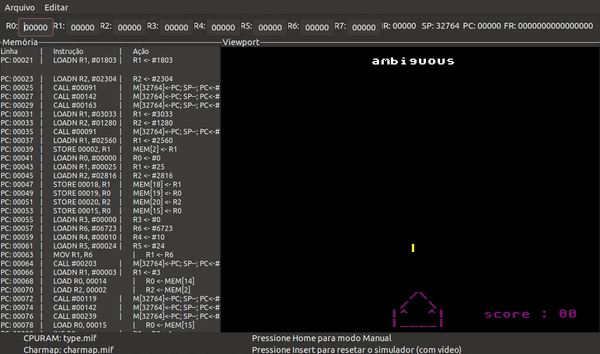
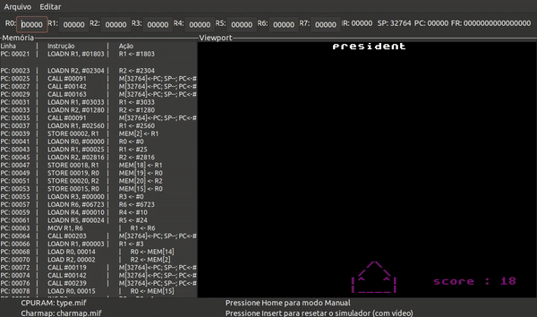
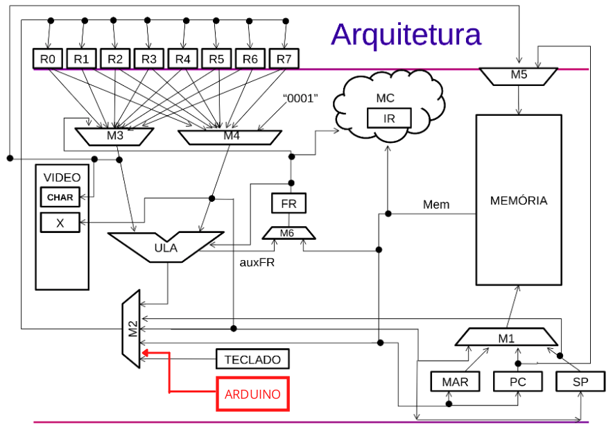
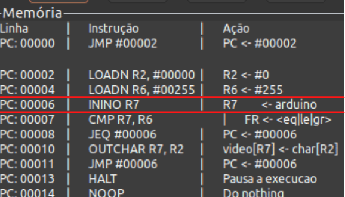
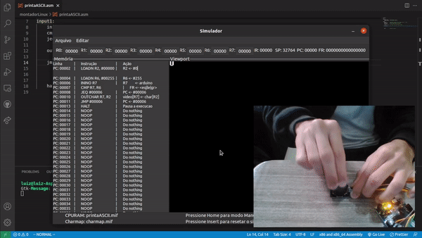

# Type The Game Assembly

**Alunos:** Luiz Fernando Rabelo (11796893) e Matheus Ventura de Sousa (11345541).

## Item 1 - Implementação do Jogo

Type The Game Assembly é um jogo de digitação single player construído com o Assembly do [Processador ICMC](https://github.com/simoesusp/Processador-ICMC). Nesse jogo, o jogador tem o objetivo de destruir as palavras que correm a tela antes que elas colidam com sua nave.



A velocidade das palavras é incremental, i.e., a velocidade aumenta a cada palavra acertada.



## Itens 2 e 3 - Construção do Hardware do Processador

### Hardware Construído

O hardware do processador foi construído em Linguagem C. A simulação da execução de um programa nessa arquitetura se dá conforme o arquivo [simpleSimulator.c](./simpleSimulator.c), tendo como base o simpleSimulator implementado durante as aulas.

### Proposta de Modificação

Como proposta de modificação, foi adicionada uma nova instrução chamada `inino`, que, em suma, lê um valor reproduzido por um Arduino conectado a uma porta USB (como se fosse um teclado) e o armazena em um registrador rx.


O OPCODE dessa nova instrução foi definido como `110110`, i.e., `54`. Um novo sinal de controle chamado `sARDUINO` foi criado para determinar uma entrada extra para o `mux2`. Assim, nas diretivas de pré-processamento foram definidos:

```c
#define sARDUINO 5  // novo sinal de controle para o mux2
#define ININO 54    // opcode decimal da operação inino
```

Já dentro da função `main`, uma nova variável foi criada a fim de armazenar o valor lido do arduino:

```c
int ARDUINO = 0;
```

Para a decodificação da `inino`, foi adicionado um novo case:

```c
switch(opcode) {
    ...
    case ININO:
        if (kbhit()) // se há um caractere não processado na entrada padrão
            ARDUINO = getchar(); // esse caractere é lido e colocado em ARDUINO
        else
            ARDUINO = 255; // se não, ARDUINO armazena 255 (valor representando "não houve entrada")
        ARDUINO = pega_pedaco(ARDUINO, 7, 0); // pegando o valor armazenado por ARDUINO % 256
        selM2 = sARDUINO; // determinando a seleção do mux2 para que ele receba entrada do arduino
        LoadReg[rx] = 1; // inicializando o registrador rx com 1 para que ele possa receber a saída do mux2
        state = STATE_FETCH; // estado de busca
        break;
    ...
}
```

Na seleção da entrada do `mux2`, foi adicionado a seguinte verificação:

```c
...
else if (selM2 == sARDUINO) {
    M2 = ARDUINO;
}
...
```

O desenho da arquitetura pode ser acompanhado a seguir:



## Item 4 - Teste do Novo Hardware

### Arquivo Montador

Para testar a nova instrução, foram feitas algumas alterações no código do montador, adicionando as informações da `inino`, além de uma referência interna no código, que foi definida pelo valor `98`. Dessa forma, no arquivo `defs.h`, foram adicionadas algumas diretivas:

```c
#define ININO "110110" // opcode da inino
#define ININO_CODE 98  // referência interna da inino
#define ININO_STR "ININO" // nome da inino no código .asm
```

Foi adicionado um case para pular a declaração da instrução:

```c
switch (op_code) {
    ...
    case ININO_CODE:
    ...
}
```

Bem como um case para a escrita da instrução em binário:

```c
switch (op_code) {
    ...
    case ININO_CODE:
        str_tmp1 = parser_GetItem_s(); // obtendo o nome do registrador da instrução
        val1 = BuscaRegistrador(str_tmp1); // convertendo o número do registrador para inteiro
        free(str_tmp1); // liberando buffer
        str_tmp1 = ConverteRegistrador(val1); // obtendo o número do registrador como string de 3 chars
        sprintf(str_msg,"%s%s0000000",ININO,str_tmp1); // concatenando OPCODE + str do número do registrador + 00..0 em str_msg
        free(str_tmp1); // liberando buffer
        parser_Write_Inst(str_msg,end_cnt); // escrevendo str_msg no arquivo
        end_cnt += 1; // endereço += 1 (a próxima instrução está na linha de baixo)
        break;
    ...
}
```

E também um case para quando o nome da instrução for lido:

```c
...
else if (strcmp(str_tmp, ININO_STR)) { // se ler um "ININO" no .asm
    return ININO_CODE; // retorna a referência interna da inino
}
...
```

### Execução no Simulador

Para o diálogo do arduino com o processador, foi desenvolvido um sketch para ler valores analógicos de um mini joystick e escrever seus indicadores correspondentes na entrada padrão. Em síntese, o programa carregado no arduino tem o seguinte comportamento:

| Valor lido do joystick | Valor escrito na entrada padrão |
| :--------------------: | :-----------------------------: |
|       MAX_EIXO_X       |           'R' (right)           |
|       MIN_EIXO_X       |           'L' (left)            |
|       MAX_EIXO_Y       |            'U' (up)             |
|       MIN_EIXO_Y       |           'D' (down)            |

Com o propósito de teste, um código simples em assembly foi elaborado para mostrar esses valores do arduino através da instrução inino. Sua representação no simulador:



A saída do simulador se deu conforme a imagem abaixo:



Tendo a nova instrução implementada e funcionando, podemos adaptar códigos de jogos já feitos, retirando as instruções `inchar`s, substituindo-as por instruções `inino`s. Como resultado, podemos jogar com joystick:


