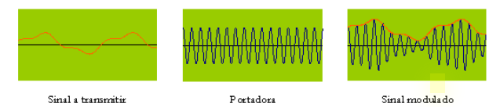

# Redes de Computadores

## Introdução à Redes

### Definição

Uma rede de computadores é um conjunto de elementos formado por dispositivos
físicos capazes de se interconectar e compartilhar informações por meio da transferência de
dados (a qual pode ser feita através de diferentes canais de comunicação), seguindo os protocolos pré estabelecidos.

### Conceitos Básicos

- **Meio de Transmissão:** Meio para realizar a comunicação (cabos, placas, modems, ...);
- **Rede de Acesso:** Rede física que conecta um sistema final (computador, provedor) ao primeiro roteador;
- **Núcleo de Rede:** Parte (enlace e roteadores) responsável por interconectar os sistemas finais;

### Protocolos de Comunicação

Um Protocolo de Comunicação é um conjunto de regras e padronizações que definem os formatos/ordem de mensagens enviadas e recebidas e as ações a serem tomadas na transmissão e recepção dessas mensagens;

Ele é composto por:

- Serviço;
- Hipóteses sobre o ambiente (meio físico);
- Vocabulário das mensagens;
- Formato das mensagens;
- Algoritmos para consistência e integridade;

### Aplicações

Interesses organizacionais em redes:

- Compartilhamento de recursos;
- Confiabilidade;
- Economia;
- Trabalho cooperativo;
- Acesso remoto à informação;
- Comunicação;

### Categorias de Redes (Quanto ao tipo de transmissão)

**Rede Ponto a Ponto**

- Canal exclusivo;
- Pacotes podem passar por mais de uma máquina;
- Múltiplas rotas de diferentes custos podem existir.

**Rede de Difusão**  

- Canal único;
- Pequenas mensagens recebidas por todas as máquinas;
- Pacotes com campo de endereço.

### Categorias de Redes (Quanto à dispersão geográfica)

**PAN**

- Redes pessoais;
- Distâncias pequenas;
- Única pessoa;
- Ex: *Bluetooth*.

**LAN**

- Redes locais;
- Dispersão geográfica limitada a poucos km;
- Comunicação de baixo custo (10 a 100Mbps);
- Ex: *Ethernet* \*.

**MAN**

- Redes metropolitanas;
- Interconexão de uma cidade;
- Comunicação de alto custo (1.5Mbps a 2.4Gbps).

**WAN**

- Redes de amplo alcance;
- Transmissão menos confiável;
- 1 erro em 100Mb transmitidos;
- Velocidade de transmissão baixa (9.6Kbps a 45Mbps);

\* *Internet* e *Ethernet*, qual a diferença? Internet é o conjunto de redes de computadores em escala mundial. Ethernet é a arquitetura de conexão cabeada de uma rede local.

### Modelo de Referência OSI/ISO - Definição

A International Standards Organization (ISO) propõe um modelo de referência para interconexão: Reference Model for Open Systems \* Interconnection (OSI). 

- Busca permitir um trabalho produtivo e independente em redes;
- Diz *o que* fazer, e não *como* fazer;
- Propõe 7 camadas: Física, Enlace de Dados, Rede, Transporte, Sessão, Apresentação e Aplicação;
- Cada camada possui fronteiras apenas com a sua camada superior e inferior;
- Cada camada é composta por serviços e protocolos.

\* Sistema aberto: sitema que está aberto à comunicação com outro sistema;

### Modelo de Referência OSI/ISO - Serviços e Protocolos

Serviços estão relacionados a proveniência de funcionalidades e protocolos a como essas funcionalidades serão executadas.

- A comunicação entre camadas distintas é feita através da requisição e resposta de serviços;
- Serviços são solicitados e respondidos através de SAPs - Service Access Points;
- O fornecimento de serviços é feito através da invocação de primitivas de serviços (ex: *connect*, *abort*, *data*);
- A comunicação entre camadas correspondentes em nós distitos é feita através de protocolos;

*Resumo*: Serviços têm caráter vertical (entre camadas de nível distinto), enquanto protocolos têm caráter horizontal (entre camadas de mesmo nível).

### Encapsulamento de dados

Os dados estão efetivamente presentes nas camadas de Aplicação, Apresentação e Sessão. Os mesmos dados são "exergados" como *segmentos* na camada de Transporte, como *pacotes* na camada de Rede, como *quadros* na camada de Enlace e como *bits* na camada Física.

Dessa forma, cada camada fica responsável por adotar uma unidade única de informação para transmissão (Protocol Data Unit, ou PDU). Cada PDU pode ser composto por cabeçalhos (headers), carga útil e rabeira (trailer).

### Modelo TCP/IP

Baseado no OSI/ISO, mas sem o objetivo de definir uma padronização específica, focando mais nos indicadores de modelos do mercado.

## Interligações

### Sentidos de transmissão

- **Simplex:** transmissão apenas em um sentido;
- **Half duplex:** transmissão nos dois sentidos, mas em um sentido por vez;
- **Full duplex:** transmissão nos dois sentidos, simultaneamente.

### Modos de transmissão - Por Condução

**Cabo coaxial**

- Longo e melhor isolante (contra ruídos);
- Quebra e mau contato com facilidade, pouco maleável.

**Par trançado**

- Usado em redes locais;
- UTP (com blindagem), STP (sem blindagem);
- A "trança" cancela ruídos (anulação de campos magnéticos);
- Full duplex, maleável, barato;
- Comprimento limitado (\<= 100m), suscetível a ruídos;
- Utiliza 2 pares de fios (1 p/ transmissão e 1 p/ recepção).
- Conexão *straight-through:* mesmas cores para ligar dispositivos diferentes;
- Conexão *crossover:* cores diferentes para ligar dispositivos iguais.

**Fibra óptica**

- Segura, imune à interferências, maior largura de banda, maior distância de cobertura;
- Cara;
- MMF (Multiple Mode Fiber): luz reflete mais de uma vez na parede da fibra;
- SMF (Single Mode Fiber): é necessário o alinhamento do feixe de luz; \*

\* O monomodo cobre uma distância até 50 vezes maior que o multimodo

### Modos de Transmissão - Por Irradiação

- Radiodifusão;
- Infravermelho;
- Satélite.

### Dispositivos de Rede

- **Repetidor:** regenera e amplifica sinais elétricos para estender o alcance da transmissão;
- **Hub:** repete os sinais recebidos para todos os dispositivos conectados a ele;
- **Switch:** "hub inteligente", que detecta os endereços dos dispositivos conectados a ele;
- **Bridge:** conecta LANs a fim de permitir que computadores de diferentes redes se comuniquem como se estivessem na mesma rede;
- **Roteador:** escolhe um caminho para que a informação chegue ao seu destino;

### Topologia (Física)

Descreve a forma em que os dispositivos estão conectados na rede (anel, estrela, barra, árvore...).

**Ponto a Ponto**

Presença de apenas 2 pontos de comunicação.

| Ponto a Ponto (Totalmente Interligada) | Ponto a Ponto (Parcialmente Interligada) |
| --- | --- |
| *N* \* (*N* - 1) / 2 conexões para ligar a rede toda | Número de conexões variável
| (V) Não há compartilhamento do meio físico | (V) Arranjo de interconexões de acordo com o tráfego
| (V) Não há preocupação com roteamento | (D) Necessita de decisão de roteamento
| (D) Completamente inviável para muitos dispositivos |  (D) Inviável para muitos dispositivos

**Multiponto**

Compartilhamento do meio físico de transmissão (i.e. hubs).

**Estrela (Ponto a Ponto)**

- Nó central mediador (hub ou switch);
- Implementada no passado p/ comunicação entre terminais e mainframes;
- Topologia mais usada atualmente;
- Fluxo: Nó Origem -> Nó Central -> Nó Destino;
- Podem operar por difusão: todos recebem a mensagem, mas apenas o nó endereçado irá processá-la;
- Boa para contextos em que o fluxo de operações é centralizado;
- Problemas:
  - Queda do nó central => rede inoperante;
  - Redundância do nó central => custo alto, se comparado ao contexto de interfaces simples em estações secundárias;
  - Desenpenho limitado pela capacidade de processamento do nó central => impossibilidade de crescimento modular;

**Anel (Ponto a Ponto)**

- Caminho fechado (geralmente unidirecional p/ simplificação);
- Topologia mais usada no backbone das redes;
- Interligação de repetidores;
- Pela interligação de repetidores, um comprimento grande pode ser contemplado;
- Falhas em repetidor podem causar parada total do sistema;
- Fluxo: Nó Origem -> Nós Intermediários -> Nó Destino;
- Boa para contextos em que o fluxo de operações não é centralizado;
- Desvantagem: Necessidade de mecanismos de acesso ao meio compartilhado;

**Barramento (Multiponto)**

- Dispositivos conectados a um meio físico comum;
- Transmissão por difusão (broadcast);
- Cada nó tem acesso a todas as informações transmitidas;
- Interfaces passivas (não causam interrupção);
- Métodos de acesso ordenado: *token passing* (controle distribuído) ou *pooling* (controle centralizado);
- Mesmos problemas que a topologia em estrela, com o atenuante de que a redundância de um nó pode ser outro nó comum da rede;

### Topologia (Lógica)

É observada do ponto de vista das interfaces de rede, referindo-se aos modos de transmissão de dados e às formas de manipulação de sinais.

## Camada Física

### Funções

- Estabelecer conexões físicas entre máquinas ligadas em rede;
- Especificar interfaces mecânicas e elétricas;
- Executar tarefas de sincronização para a rede;
- Converter informações de bits para sinais que são passados para meios de transmissão;

### Sinais

| Analógicos | Digitais |
| --- | --- |
| Valores contínuos em intervalos de tempo | Valores discretos em intervalos de tempo |
| Exemplos de dados: áudio e vídeo | Exemplos de dados: arquivos em um computador |

### Largura de Banda - Banda Base e Banda Larga

- Diferença entre a maior e menor frequência que pode ser utilizada para a transmissão de sinais em um meio físico;
- Medida em Hz;
- As 2 formas de utilizar a capacidade do meio físico são _banda base_ e _banda larga_.

**Banda Base**

- Toda largura de banda é usada por um único canal;
- Frequentemente utilizada para transmissão digital.

**Banda Larga**

- Divisão da largura de banda em múltiplos canais;
- Cada canal pode transmitir múltiplos sinais analógicos, simultaneamente.

### Largura de Banda - Transmissão

**Baud Rate**

- _baud rate_ = _Velocidade de Amostragem_ = número de vezes por segundo que um sinal é capaz de mudar seu valor;

**Bit Rate**

- _bit rate_ = número de bits por segundo que um podem ser transmitidos em um canal;

### Largura de Banda - Teorema de Nyquist

- V_max de transmissão de um canal = 2 _W log\_2L_ bits/seg, _W_ largura da banda em _Hz_, _L_ número de níveis do sinal;

### Problemas na Transmissão - Tipos

**Atenuação**

- Queda de potência de um sinal, em razão da distância / meio físico;
- Pode ser contornada pelo uso de repetidores;

**Distorção**

- Mudança no formato de onda devido aos atrasos diferentes em diferentes frequências;

**Eco**

- Reflexão do sinal quando há mudança da impedância (resistência à passagem de sinal alternado) do meio de transmissão;

**Ruído**

- Sinais indesejados inseridos entre a transmissão e recepção;
- Medido pela razão potência do sinal (_S_) por potência do ruído (_N_) = _S/N_;
- Ou mais comumente por _10 log\_10(S/N)_, valor em decibel (dB);
- Pode ser _térmico_ (agitação dos elétrons nos condutores), _intermodular_ (interferência pela multiplexação de frequência), _crosstalk_ (interferência por condutores próximos) ou _impulsivo_ (pulsos irregulares de grande amplitude);

### Problemas na Transmissão - Teorema de Shannon

- Taxa_max de transmissão de um canal = _W log\_2(1+S/N)_ bps, _W_ largura de banda em _Hz_, _S/N_ relação sinal ruído;

### Tipos de Transmissão

Transmissões podem ser feitas de forma analógica ou digital, a partir de dados analógicos ou digitais:

### Transmissão Analógica

**Modulação (Definição):**

- Conversão de dados (digitais ou analógicos) em analógicos;
- Tipos:
  - AM - Amplitude Modulation: sinais sensíveis ao ruído e interferência;
  - FM - Frequency Modulation: sinais menos sensíveis ao ruído e de melhor qualidade;
  - PM - Phase Modulation.

**Modulação (Funcionamento):**

- ASK - Amplitude Shift Keying: altera os valores da amplitude para representar os bits;
- FSK - Frequency Shift Keying: altera os valores da frequência para representar os bits;
- PSK - Phase Shift Keying: altera os valores das fases para representar os bits; \*

\* Hoje o modelo mais usado é o QAM (Quadrature Amplitude Modulation Keying), uma combinação de ASK-PSK com a divisão de diferentes ângulos de fase.

### Transmissão Digital

**Codificação (Definição)**

- Processo de conversão de dados em sinais digitais que os representam;
- Tipos:
  - NRZ Non Return to Zero;
  - NRZI Non Return to Zero Inverted;
  - Manchester;
  - Codificação 4B e 5B;

**Codificação (NRZ e NRZI)**

- NRZ: Tensão positiva 1, negativa 0 ou vice-versa;
- NRZI: Quando ocorre 1, o sinal é invertido. Quando zero, permanece o mesmo;
- Vantagen:
  - conceito simples e de fácil implementação;
- Desvantagens:
  - problemas de sincronização (NRZ p/ longas sequências de "0" e "1", NRZI p/ longas sequências de "0");
  - geração de distorções do sinal ao passar por transformadores;

**Codificação (Multinível Binária)**

- Bipolar Alternate Mark Inversion (Bipolar-AMI)
  - Bit 0: ausência de sinal;
  - Bit 1: pulso negativo ou positivo (alternado);

- Pseudoternário
  - Bit 1: ausência de sinal;
  - Bit 0: pulso negativo ou positivo (alternado);

- Vantagens:
  - Sem perda de sincronismo para um dos bits;
  - pode-se usar transformador para isolar a linha de transmissão;
  - fácil de detectar erros.
- Desvantagens:
  - lidar com receptores de 3 níveis (+A, -A, 0);
  - requer 3dB a mais de potência de sinal, para mesma probabilidade de erro de bit.

**Codificação Manchester (Definição)**

- Codificação no meio do tempo do bit;
- 2 Tipos:
  - Manchester;
  - Manchester Diferencial.
- Vantagens:
  - Sincronismo no meio da transição de bit;
  - Nenhum componente DC (pode-se usar transformador);
  - Ausência de uma transição permite a detecção de erros;
- Desvantagem: exige largura de banda 2x maior que o NRZ.

**Codificação Manchester**

- Transição no meio de cada período de bit;
- Transição server como clock e dado;
- Transições:
  - Alto p/ baixo = 0;
  - Baixo p/ alto = 1;
- Usada no IEEE802.3 (Ethernet);

**Codificação Manchester Diferencial**

- Transição no meio de cada período de bit;
- Transições:
  - Inversão da transição = 0;
  - Nenhuma transição = 1;
- Usada no IEE802.5 (Token Ring)
- Vantagem ao Manchester: mais resistente a ruídos;
- Desvantagem: para saber o estado do sinal atual, deve-se conhecer o estado do sinal anterior;

**Multiline Transmition Three Level (MLT-3)**

- Parece com NRZI, mas utiliza 3 níveis;
- Bits para estados:
  - 0: nada acontece;
  - 1: se o bit 1 não zero anterior for positivo, subtraia V, senão adicione V;
- Vantagens:
  - requer banda larga menor que a codificação bifásica;
  - resulta em menos interferência eletromagnética;
- Desvantagem:
  - Receptor deve distinguir entre 3 níveis distintos (+A, -A, 0);

**Codificação por Bloco 4B/5B**

- Minimiza o problema de sincronização;
- Reduz sequências de 0s;
- Cada 4 bits são mapeados para uma sequência de 5 bits;
- Com a "sobra" de bits no contradomínio, podem ser alocados blocos para controle de transmissão.

**PAM - Pulse-Amplitude Modulation e PCM - Pulse-Code Modulation**

- O PCM converte sinais analógicos em digitais por meio de 3 etapas:
  - Amostragem: modula o pulso por amplitude;
  - Quantização: discretiza as amostras da modulação por amplitude (PAM); 
  - Codificação: mapeia a amplitude quantizada para códigos binários;

## Camada de Enlace

### Arquitetura IEEE 802

- Normas para LANs e MANs;
- Adotado por ANSI, NIST, e ISO;
- Dividido em subcamadas: _LLC_ e _MAC_;
- Usa enquadramento para organizar / agrupar os dados (em frames);
- Usa o Media Access Control para escolher o computador transmissor;

**802.1**

- Conjunto de padrões e primitivas de interface;

**802.2 (LLC - Logical Link Control)**

- Descreve a parte superior da camada de interface e primitivas de interface;
- É independente do MAC;
- Provê um serviço de enlace com controle de erro e controle de fluxo.

**802.3 (CSMA/CD - Carrier Sense Multiple Access with Colision Detection)**

- Especifica a camada física e parte do acesso à camada de enlace (Ethernet);

**802.x**

Algumas dos outros protocolos LAN definidos pela IEEE802 são:

- _IEEE802.4:_ redes em barramento;
- _IEEE802.5:_ redes em anel;
- _IEEE802.11:_ redes sem fio (wi-fi);

### Media Acess Control (MAC)

- Estabelece protocolos que determinam o dispositivo com permissão de transmitir dados em um domínio de colisão;
- Controle determinístico (revezamento) ou não determinístico (FIFO);
- Utiliza drivers para acessar a camada física;

### Endereços MAC

- 48 bits de comprimento expressos em 12 dígitos hexadecimais;
- 6 primeiros dígitos identificam o fabricante (são gerenciados pela IEEE);
- 6 últimos dídigos identificam o dispositivo (são gerenciados pelo fabricante);
- são _Burned In Adreesses_: queimados na ROM e trazidos para a RAM durante a inicialização da placa de rede;
- Meio de identificação dos dispositivos na rede local;

### Ethernet e IEEE802.3

- LANs baseadas em CSMA/CD;
- redes de broadcast; 
- implementadas através de hardware;

### Função da Camada de Enlace

Transferir dados da camada de rede de uma máquina de origem p/ a camada de rede de uma máquina de destino. Para isso:

- Delimita quadros (grupos de bits transmitidos pela rede), adicionando também "endereços físicos" usados nos headers dos quadros para identificar sua origem e destino;
- Gerencia o acesso ao enlace em meios compartilhados. Dessa forma, depende da camada física para envio e recebimento de bits;
- Faz tratamento de erros sobre quadros, alertando tranmissores para retransmitilos caso necessário, ou corrigindo diretamente o bit com erro se conseguir (esse tratamento é opcional);

### Protocolos de Enlace

Possuem:

- _Cabecalho_: informações de controle p/ comunicação entre camadas de enlace. É dividido em campos; 
- _Dados_: PDU da rede;
- _CDE_: Código de detecção de erro;

### Serviços

|Tipo \ Propriedades | Conexão Previamente Estabelecida | Confirmação de Recepção | Tratamento de Erro | Tipos de Aplicação |
| --- | --- | --- | --- | --- |
| **Sem Conexão Não Confirmado** | não | não | Quadros perdidos ignorados e tratados por camadas superiores | Aplicações com baixa  taxa de erro, em que dados ruins são melhores que dados atrasados (e.g. _streaming_ de áudio) \* |
| **Sem Conexão Confirmado** | não | sim | Cada frame é individualmente confirmado, dando possibilidade de retransmissão | Canais não confiáveis, como Wireless |
| **Orientado a Conexão Confirmado** | sim | sim | Quadros são numerados e recebidos em ordem, garantindo uma sequência de bits corretos para a camada de rede | Aplicações críticas que dependem de atualizações em tempo real e podem arcar com o custo desse serviço |

\* melhores => menos piores

### Delimitação de Quadros

Os principais métodos para delimitação de quadros são:

- _Contagem de caracteres_:
  - usa campo no cabeçalho para indicar o número de caracteres por quadro;
  - não é usado na prática pois erros no cabeçalho de 1 quadro levam à inconsistência no reconhecimento dos demais;
- _Caracteres de início e fim_:
  - Coloca delimitadores no início e fim de um quadro;
  - DLE STX no início e DLE ETX no fim (Data Link Scape, Start/End Text);
  - Coloca um DLE adicional antes de cada DLE para escape (como se fosse um "\\"), técnica denominada _byte stuffing_;
  - usado em protocolos orientados a caracteres;
- _Flags de Início e Fim_:
  - Usa flags (conjuntos de bits) para delimitar início e fim de quadros (ex 01111110);
  - Sempre que 5 1s são encontrados, o emissor insere um 0 (bit-stuffing);
  - Sempre que 5 1s são encontrados, o receptor remove um 0 (o stuff é retirado);
- _Violação de Código_:
  - Baseado na camada física (por isso violação): início e fim de quadro são determinados por um código de transmissão no meio do período de Manchester;
  - 1 => par alto-baixo;
  - 0 => par baixo-alto;
  - Os pares alto-baixo e baixo-alto não são usados na codificação Manchester e por esse motivo, podem ser usados para a delimitação de quadros;
  - Usado no IEEE802.

### Controle de Erros

**Bit de Paridade**

- Inserção de bit extra no final de cada caractere, de forma a deixar todos os caracteres com paridade par ou ímpar de 1s;
- Usado em transmissões de baixa velocidade que apresentam poucos erros;
- Pode ser bidimensional (considerando a mensagem como uma matriz, o bit extra é colocado ao fim de cada linha e coluna);

**Checksum**

- Opera sobre palavras;
- Divide a mensagem em segmentos, soma os segmentos e transmite o complemento da soma;
- O receptor também soma os segmentos e verifica se a soma bate;

**Redundância Cíclica (CRC)**

- Técnica mais utilizada;
- Emissor e receptor concordam com um _Gerador_ (polinômio divisor);
- Transmissor transmite _mensagem_ + _resto da divisão da mensagem pelo gerador_;
- Receptor recebe os dados transmitidos e divide pelo _Gerador_. Se der resto 0, tudo ok. Se não, houve erro.

**Código de Hamming**

- Todo bit que é potência de 2 vira bit de paridade;

### Controle de Fluxo

Como sincronizar a transmissão? (fazer com que o transmissor e o receptor transmitam na mesma velocidade)

**Stop-and-Wait ARQ (Automatic Repeat reQuest)**

- Pacotes numerados com 1 bit;
- Se não houver confirmação de recepção do quadro, ele é retransmitido após um _timer_;

**Go-Back-N ARQ**

- São transmitidos conjuntos de quadros (de tamanho N) e confirma-se o último;
- Protocolo "Janela Deslisante";
- Manda _ACK n_ (recebi o quadro _n-1_, pode me mandar o quadro _n_);

**Selective-Repeat ARQ**

- Utiliza 2 janelas: 1 de transmissão e 1 de recepção;
- Quadros que foram recebidos após um quadro perdido não são descartados;
- Manda _NAK n_ (não recebi o quadro _n_), além de _ACKs n_;

**Piggybacking**

- Coloca o _ACK_ no cabeçalho do quadro enviado de volta, pegando "carona";
- Utiliza melhor a largura de banda;

### O Protocolo PPP - Point to Point Protocol

- Realiza tratamento de erros;
- Reconhece e trata diferentes protocolos;
- Permite que IPs sejam negociados em tempo de conexão;
- Permite autenticação;
- Orientado a caractere;
- Muito utilizados em SONETs (redes de fibra óptica conectadas a longa distância) e ADSLs (Asymetric Digital Subscriber Lines, que conectam clientes com ISPs);
- Quadro:
  - Delimitado pela flag 01111110;
  - Endereço tem valor fixo 11111111;
  - Controle tem valor fixo 00000011;

### Acesso ao Enlace - Alocação de Canais

**Alocação Estática**

- Utiliza multiplexação;
- Número de usuários pequeno e fixo;
- Cada usuário demanda tráfico pesado;

**Alocação Dinâmica**

- Tráfego independente (entre diferentes estações);
- Premissa de canal único (apenas 1 canal é utilizado para transmissão / recepção);
- Colisões observáveis (colisões podem ser tratadas e quadros podem ser retransmitidos);
- Tempo contínuo ou segmentado (quadros transmitidos a qualquer instante ou tempo de transmissão dividido em slots);
- Detecção de portadora (pode ser detectado através da portadora se o determinado canal está em uso);

### Protocolos de Acesso Múltiplo

A principal função da subcamada MAC é definir como as estações compartilham o canal de comunicação. Existem 3 grandes classes de protocolos de acesso múltiplo:

**Particionamento de canal (Alocação Estática)**

- TDMA - Acesso Múltiplo por Divisão de Tempo
  - Acesso feito por "turnos";
  - Cada estação controla um _slot_ de período fixo em cada turno;
  - _slots_ não usados são desperdiçados;
- FDMA - Acesso Múltiplo por Divisão de Frequência
  - Canal dividido em bandas de frequência;
  - Cada estação recebe uma banda de frequência;
  - Tempo de transmissão não usado nas bandas é desperdiçado;
- CDMA - Acesso Múltiplo por Divisão de Códigos
  - Um código é atribuído a cada usuário;
  - Todos usam a mesma frequência e transmitem ao mesmo tempo, mas cada um tem uma forma de codificar os dados;
  - Muito usado em canais broadcast sem fio;

**Acesso aleatório (Alocação Dinâmica)**

Quando um nó tem pacote a enviar, ele tenta transmitir com toda a taxa do canal, mas, dessa forma, é necessária a adoção de protocolos para tratamento de colisões:

- ALOHA puro:
  - Colisão => aguardar um tempo aleatório para realizar a retransmissão;
  - Taxa baixa de sucesso (no máximo 18%);
- ALOHA slotted:
  -  Colisão => aguardar uma unidade de slot de tempo para realizar a retransmissão;
  - Taxa baixa de sucesso (no máximo 37%);
- CSMA - Acesso Múltiplo com Detecção de Portadora
  - Escuta antes de transmitir (se o canal estiver vazio, transmite; se não, adia a transmissão);
  - Se houver colisão, aguarda um tempo aleatório para tentar novamente (mas não consegue interromper a transmissão corrente);
- CSMA/CD - Acesso Múltiplo com Detecção de Portadora / Detecção de Colisão
  - Escuta o canal enquanto transmite;
  - Se detectar colisão, interrompe a transmissão;
  - Possui Recuo Exponencial Binário (ao detectar _n_ colisões ao longo do tempo, escolhe um valor de _K_ em {0, 2, 4, ..., 2^n - 1} para aguardar);
  - Usado no Ethernet IEEE802.3.

**Passagem de permissão**

- Polling:
  - Nó mestre convida os escravos a transmitirem um de cada vez, de maneira circular;
  - Quando cada nó termina sua transmissão, o nó mestre repassa a pérmissão para o próximo;
  - Usado no IEEE802.15 (base do Zigbee) e no Bluetooth;
  - Tem muita latência e dependência do nó mestre.
- Token Passing:
  - Não há nó mestre, mas há um token passado de nó a nó, sequencialmente;
  - Usado nos protocolos FDDI e IEEE 802.5 Token Ring;
  - Tem muita latência e dependência do token.

### O Protocolo Ethernet

- Definido pelo padrão IEEE802.3;
- Predominante em LANs com fio;
- Evolução: barramento com CSMA/CD -> topologia estrela com hubs -> utilização com switches;
- Oferece serviço sem conexão não confirmado => simplicidade e baixo custo;

**Quadro do Ethernet**

- _Preâmbulo_: sequência de 0s e 1s alternados para sincronização em implementações mais lentas (como no Ethernet assíncrono de 10Mbps; 
- _Endereços de Destino/Origem_: MACs das máquinas de origem e destino;
- _Tipo_: especifica o protocolo da camada superior, e indica a quantidade bytes válidos que vêm depois desse campo; 
- _Preenchimento_: padding se sobrar espaço;
- _Checksum_: campo para verificação de validade;

### Endereços de LAN e ARP

**Endereços IP**

- Endereços lógicos, que tangenciam as camadas de enlace e de rede;
- IPv4: 32 bits;
- IPv6: 128 bits;

**ARP - Address Resolution Protocol**

- Mapeia IPs para MACs através da Tabela ARP;
- Cada nó IP de uma LAN possui um módulo e uma Tabela ARP;

### Comutadores (Switches)

- Recebem quadros da camada de enlace e repassam-los para enlaces de saída;
- Filtram os quadros, determinando se devem ser repassados ou descartados;
- Não possuem IP, apenas endereços MAC.

## Camada de Rede

### Funcionalidades

- _Determinação de caminhos_: rota escolhida pelos pacotes entre origem e destino (determinada por algoritmos de roteamento);
- _Comutação_: mover pacotes entre portas de entrada e saída de roteadores;
- _Estabelecimento de conexão_: estabelecimento de circuitos virtuais antes da transmissão de dados;

### Serviços de Entrega de Pacotes

**Redes de Circuitos Virtuais (VC)**

- Conexão antes do envio de dados;
- Libera-se a conexão após troca de dados;
- Cada pacote transporta um identificador do VC, não o endereço completo de destino;
- Vantagens:
  - Orientado ao desempenho;
  - Recursos alocados pelo VC;
  - Controle de qualidade de serviço controlado pelo VC.

**Redes de Datagramas**

- Não estabelece conexões (circuitos virtuais);
- Não há informação de estado de conexão nos roteadores;
- Pacotes transportam o endereço de destino;
- Pacotes para o mesmo destino podem seguir rotas diferentes => nesse caso pacotes são chamados datagramas;
- Usada na Internet;

### Roteamento

- Algoritmos descritos através de grafos;
- Nós -> roteadores;
- Arestas -> enlaces (seus valores representam atraso, preço ou nível de congestionamento);

### Roteamento - Classificação quanto à Informação dos Vizinhos

**Algoritmos de Informação Global (Link State)**

- todos os roteadores têm informações completas da topologia e custo dos enlaces; 

**Algoritmos de Informação Descentralizada**

- roteadores conhecem informações dos vizinhos e enlaces até chegar aos vizinhos;
- proceso de computação interativo, com trocas de informações entre vizinhos;

### Roteamento - Classificação quanto à Mutabilidade do Caminho

**Algoritmos Estáticos**

- rotas mudam lentamente ao longo do tempo;
- mudanças de rotas feitas por adms de redes;

**Algoritmos Dinâmicos**

- rotas mudam rapidamente;
- atualizações periódicas, com mudanças podendo corresponder a alterações no custo dos enlaces;

### Roteamento - Algoritmos

**Shortest Path**

- Estático e global;
- Calculado por Dijkstra;

**Flooding**

- Estático e descentralizado;
- Pacotes que chegam são reencaminhados para todas as linhas, menos a de origem;

**Distance Vector (Ford-Fulkerson)**

- Dinâmico e descentralizado;
- Cada nó mantém um vetor de distâncias até seus vizinhos;
- Se o custo até o vizinho mais o custo no vetor recebido for menor do que o valor no seu pŕoprio vetor, esse custo ́e atualizado e a nova rota é atualizada na tabela de roteamento;

**Estado de Enlace**

- Dinâmico e global;
- É o Shortest Path, mas dinâmico.

### Roteamento Hierárquico

- Agrega roteadores em regiões chamadas Sistemas Autônomos (AS) - áreas administrativas em que um adm gerencia um conjunto de roteadores;
- Roteadores no mesmo AS rodam o mesmo protocolo de roteamento (protocolos Intra-AS);
- Roteadores em diferentes ASs podem rodar protocolos diferentes de roteamento (protocolos Inter-AS);
- Roteadores de borda: roteadores que realizam roteamento Intra e Inter AS;

### Endereços IPv4 - Definição

- Identificadores de 32 bits (IPv4) para interfaces de roteadores e hosts;
- Cada conjunto de 8 bits é chamado octeto;
- Interface: conexão entre roteador ou host e enlace físico. Um roteador _deve_ ter múltiplas interfaces e um host _pode_ ter múltiplas interfaces;
- Os endereços IP são associados com interfaces, não com o host ou roteador; 
- Os bits mais significativos identificam a rede, e os menos significativos identificam o host;

### Endereços IPv4 Especiais

### Endereços IPv4 Classful

- Classe A endereça 2⁷ = 128 redes e 2²⁴ - 2 = 16777214 hosts por rede;
- Classe B endereça 2¹⁴ = 16384 redes e 2¹⁶ - 2 = 65534 hosts por rede;
- Classe A endereça 2²¹ = 2097152 redes e 2⁸ - 2 = 254 hosts por rede;

### Endereços IPv4 Classless

- Porção do endereço de rede tem tamanho arbitrário;
- Seguem o formado _A.B.C.D/x_, em que _x_ é o número de bits na parte de rede;

### Datagramas no IPv4

- Se o endereço lógico de destino não estiver na mesma rede, o roteador consulta sua tabela de roteamento para enviar o datagrama para outra rede;
- Se o endereço lógico de destino estiver na mesma rede, o pacote de dados é passado para a camada de enlace;

### Máscaras de Rede

- Formadas por 32 bits no mesmo formato que o IP;
- Utilizada para definir à qual rede pertence o computador;
- A rede do computador é definida a partir de um AND entre o endereço do computador e a máscara;
- Nas máscaras, o bit 1 representa a parte do endereço que será usada para rede, e o bit 0 representa a parte da rede que será utilizada para host;
- Máscaras mais comuns:
  - 255.0.0.0: IPv4 classe A;
  - 255.255.0.0: IPv4 classe B;
  - 255.255.255.0: IPv4 classe C;

### Subredes

- Subredes podem ser criadas a partir da alteração da estrutura do endereçamento IP (à critério do ADM de rede), a partir da divisão do número do host. Para que a extração dos endereços de rede funcione corretamente, é definida uma máscara de rede "não padrão".

### NAT - Network Addressing Translation

- Criada p/ reduzir o número de endereços públicos na Internet;
- Os dispositivos habilitados para NAT, com acesso à rede pública representam computadores da rede privada;
- Esses dispositivos (geralmente roteadores) operam na borda de rede stub (rede com conexão única p/ rede externa);
- A NAT faz o mapeamento IP a IP (origem e destino), e, para que não existam mapeamentos duplicados, utiliza multiplexação no nível de portas (PAT);
- Diminui a rastreabilidade, dado que diversas alterações de endereço são feitas durante a transmissão;

### Controle de Congestionamento

- Pode ser feito por:
  - descarte de pacotes;
  - pré alocação de buffers;
  - controle isorrítmico (limitação de pacotes em trânsito);
  - controle de tráfego na camada de enlace;
- Pode ser categorizado em:
  - _Open Loop_: não propõe resolução em tempo real (um bom projeto deve garantir a inibição de problemas);
  - _Closed Loop_: tentativa de melhoria a partir de feedbacks em tempo real (monitoração -> mapeamento de solução -> correção do problema);

### ICMP - Internet Control Message Protocol

- Protocolo utilizado para reporte de erros e para testes (ping);
- Não é um protocolo que visa trocar mensagens, é apenas de controle;
- As mensagens mais importantes são:
  - _Destination Unreachable_ (destino não encontrado);
  - _Time Exceeded_ (TTL = 0);
  - _Source Quench_ ("emissor, reduza seus dados!");
  - _Redirect_ (outro roteador tem uma rota melhor);
  - _Echo_ (utilizado pelo ping);
  - _Echo Reply_ (resposta do ping);

### Entrega de Pacotes

- Direta: mesma rede (IP_ORIGEM & MASCARA_ORIGEM = IP_DESTINO & MASCARA_DESTINO);
- Indireta: redes diferentes (IP_ORIGEM & MASCARA_ORIGEM != IP_DESTINO & MASCARA_DESTINO)

### Protocolos de Roteamento - Tabela de Roteamento

- Uma tabela de roteamento possui como colunas: _Rede de Destino_, _Próximo Salto_ e _Interface de Saída_;
- Exemplo de tabela de roteamento:

- Nesse exemplo, o roteador tem 3 interfaces, está conectado à 2 redes locais e tem 1 saída;
- Além das informações supracitadas, a tabela de roteamento contém também informações sobre métricas de roteamento (Ex: RIP - contagem de saltos, IGRP - largura de banda, carga, atraso e confiabilidade)

### Protocolos de Roteamento - Gateway Padrão

- Portal de acesso à uma rede que não se encontra na coluna _Destino_ da tabela de roteamento;
- A rota _default_ é uma rota estática endereçada a 0.0.0.0 com máscara 0.0.0.0;
- O exemplo de tabela de roteamento do tópico anterior pode ser reescrito como:

### Protocolos IGP e EGP

- IGP - Interior Gateway Protocol: roteamento interno (Intra-AS);
- EGP - Exterior Gateway Protocol: roteamento externo (Inter-AS);

### Protocolos de Roteamento vs Protocolos Roteáveis

- Protocolo roteável: protocolo que define a estrutura do pacote e o endereçamento lógico na camada de rede. Protocolo que permite ser roteado entre redes. Ex: IPv4 e IPv6;
- Protocolo de roteamento: Permitem que roteadores conectados criem um mapa de outros roteadores na rede. Protocolo que determina como o protocolo roteável é encaminhado.

### Endereços IPv6 - Estrutura

- 128 bits;
- representado em hexadecimal;
- oito blocos de 16 bits separados por dois pontos;
- os 4 últimos blocos são determinados pelo MAC da máquina;

### Endereços IPv6 - Especificidades

- Não tem endereço de broadcast;
- Possuem endereços de unicast e endereços de multicast;
- O IID é formado pelos 48 bits do endereço MAC (o MAC é dividido ao meio e, entre as 2 partes, são inseridos FF FE). O bit 41 do MAC determina se o endereço é local ou universal e esse bit, no IID, trata-se no 7° bit da esquerda para a direita. Ele sempre é trocado (de 1 p/ 0 ou 0 p/ 1);

### Endereços IPV6 - Tipos

- Unicast: IPs usados para endereçar cada máquina / dispositivo na rede;
- Anycast: Ips usados com o intuito de permitir que mais de uma máquina física responda por um mesmo IP (ex: DNS);
- Multicast: IPs usados para endereçar máquinas que pertencem a um mesmo grupo (tipo mais parecido com o broadcast). Os endereços de Multicast sempre começam com ff;
- Formato do Unicast / Anycast:

- Formato do Multicast:

## Camada de Transporte

### Funções Básicas

- Aceitar dados da camada de aplicação, dividi-los e repassa-los para a camada de rede;
- Aceitar dados da camada de rede, uni-los e repassa-los para a camada de aplicação;
- Ligar origem a destino para a transmissão de _segmentos_ (PDU da Camada de Transporte);
- Endereços de segmento = IP + Porta (cada porta tem 16 bits);

### Protocolos e Serviços de Transportes

- A Camada de Rede estabelece a transferência de dados entre computadores;
- A Cama de Transporte estabelece a transferência de dados entre processos;
- O transporte pode ser não confiável (UDP) ou confiável (TCP);

### UDP - Definição

- User Datagram Protocol
- Protocolo "sem gorduras", com serviço "best effort";
- Segmentos UDP = datagramas;
- Não há conexão nem confirmação entre receptor e transmissor;
- Datagramas podem ser perdidos ou entregues fora de ordem;
- Protocolo simples, de baixo custo e sem controle de congestionamento;
- Usado por aplicações de multimídia contínua (voz e vídeo);
- Usado no DNS;

### TCP - Definição

- Tranfer Control Protocol
- Protocolo "com gorduras";
- Fluxo de bytes fim a fim confiável em rede não confiável;
- Permite entrega sem erros;
- Projetado para ser robusto diante dos muitos tipos de falhas que podem ocorrer;

### TCP - Estabelecimento de Conexões

- É feito por meio dos bits SYNC e ACK;
- Inicializada com o Three Way Handshake:
  - Cliente: "Servidor, vc está aí?" SYN = 1;
  - Servidor: "Sim, estou. Vc está aí?" ACK = 1, SYN = 1;
  - Cliente: "Sim, estou." ACK = 1;

### TCP - Controle de Fluxo

- Múltiplos pacotes são enviados em paralelo, e os reconhecimentos são feitos, também em paralelo;
- Protocolo Janela Deslisante GO-BACK-N ARQ, em que conjuntos de bacotes são enviados, se não receber nenhum ACK relativo ao conjunto, o conjunto é retransmitido e não há espera na transmissão como acontece no STOP AND WAIT ARQ;

### Controle de Congestionamento na Camada de Transporte

**Controle Fim a Fim**

- nenhum feedback explícito da rede;
- congestionamento deduzido por observações (atrasos / perdas);
- usado pelo TCP;

**Controle Assistido pela Rede**

- roteadores fornecem feedbacks a sistemas finais;
- controle melhor implementado;
- usados em redes ATM;

## Camada de Aplicação

### Conceituação

- Camada da borda da rede;
- Serve de interface com o usuário;
- Seguem arquiteturas (Cliente-Servidor, P2P ou híbrida).

### Exemplos de Aplicações de Rede

- E-mail;
- Web;
- Serviços de streaming;
- Videoconferência em tempo real.

### Arquitetura Cliente-Servidor

- Servidor é um processo executado em hospedeiro com IP permanente;
- Cliente inicia a sessão com o servidor, podendo ou não ter IP dinâmico.

### Arquitetura P2P

- Hosts se comunicam entre si;
- Todos oferecem serviços (hora como clientes, hora como servidores);
- Exemplo: BitTorrent.

### Arquitetura Mista

- A troca de mensagens entre usuários é P2P;
- A detecção / localização de usuários é feita a partir da arquitetura Cliente-Servidor.

### Sockets

- Sockets são a porta de saída de aplicações;
- Possuem endereço lógico (IP) e número de porta.

### Protocolo HTTP

- Páginas Web são consistidas de objetos (arquivos HTML, imagens JPEG, arquivos de áudio, etc);
- Cada objeto é endereçado por uma URL (Uniform Resource Locator);
- O HTTP segue o modelo Cliente-Servidor;
- Conexões podem ser persistentes (mais de 1 objeto pode ser enviado sobre 1 conexão) ou não persistentes (1 único objeto é enviado a cada conexão);

### Protocolo FTP

- Transporta arquivos entre sistemas de arquivo local e remoto;
- Estabelece conexões de controle e de dados;
- Não tão seguro para os padrões atuais.

### DNS

- Diretório da Internet;
- Tradutor de nomes de hospedeiros para endereços IP;
- Banco de dados distribuído;
