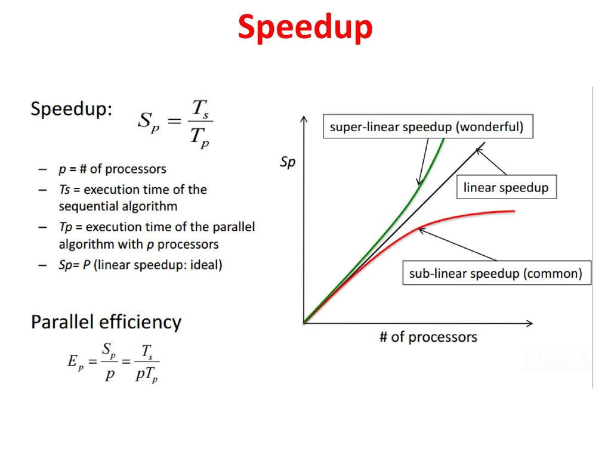
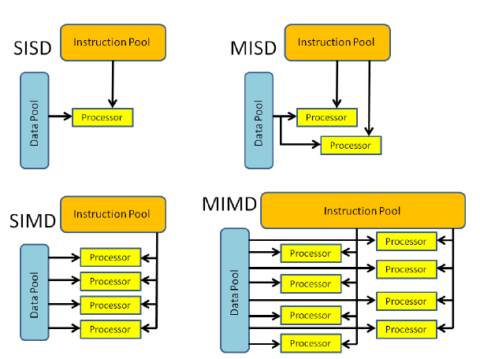
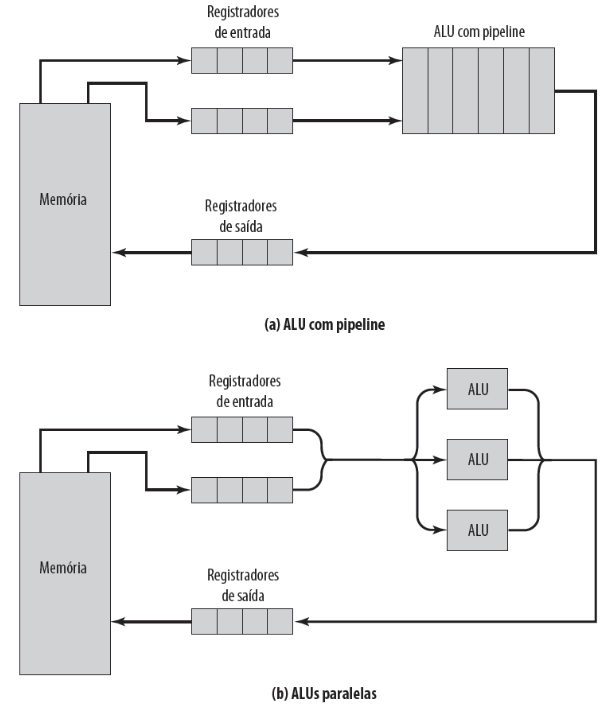
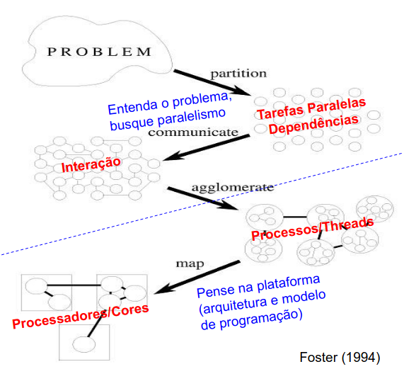

# Computação de Alto Desempenho

## Conceitos Básicos

- **Computação Paralela** utilização de _computador(es) paralelo(s)_ para aumentar a eficiência, usando _Programação Paralela_;
- **Computador Paralelo** computador com _múltiplos processadores_ / memórias / dispositivos duplicados;
- **Programação Paralela**: programação em que se determina quando e como determinadas tarefas podem ser executadas por diferentes processos ao mesmo tempo (lógico);
- **Programa**: código fonte escrito em uma linguagem de programação;
- **Processo**: programa em execução. Possui pilha, dados, registradores, etc;
- **Threads**: "processos leves". São linhas de execução de um processo maior;
- **Processos Concorrentes**: aqueles que iniciaram mas não finalizaram sua execução e que, portanto, _concorrem_ por recursos;
- **Processos Paralelos**: especialização de processos concorrentes, em que os processos são executados em processadores paralelos (paralelismo real);
- **Processos Distribuídos**: _processos paralelos_ com o objetivo de compartilhamento de recursos;
- **Interação**: comunicação (troca de dados) e sincronização (garantia de ordem de execução) entre processos;
- **Granulação**: relação entre computação e interação. Mais computação frente à mesma interação => maior granulação. Granulações finas oferecem maior grau de paralelismo, mas, na prática, o custo de interação faz com que a computação e, consequentemente, a granulação aumente para que a interação seja vantajosa;
- **Tempo**:
  - De execução: tempo executando instruções do processo na CPU. Pode ser dividido em:
    - sistema: instruções relativas à syscalls;
    - usuário: instruções relativas instruções de usuário (add, sub, branches, etc);
  - De resposta: tempo entre a submissão do processo e seu retorno (inclui tempo ocioso);
  - Ocioso: tempo levado no aguarde para executar (E/S, fila de pronto, etc);

OBS: _Programação Paralela_, tem o sinônimo de _Programação Concorrente_ e de _Programação Distribuída_, sendo esses nomes variáveis ao contexto da aplicação;

## Métricas para Avaliação de Ganho de Desempenho

- **Speedup (Sp)**: determina o ganho de desempenho;
  - Absoluto: Tseq = tempo (de resposta) do melhor algoritmo sequencial;
    - Speedup = Tseq / Tpar_p, usando p processadores;
  - Relativo: Tseq = Tpar usando 1 processador;
    - Speedup = Tpar_1 / Tpar_p, usando p processadores;
- **Eficiência (E_p)**: determina a eficiência no uso de p processadores;
  - E = Speedup / p;
- **Escalabilidade**: eficiência permanece constante quando a carga de trabalho e número de processadores aumentam ou diminuem;

Resumindo:

## Arquiteturas Paralelas

### Modelos (Níveis) para Arquiteturas Paralelas

- _De Máquina_: modelo de mais baixo nível. Envolve registradores, bufferes, etc.
- _Arquitetural_: descreve a rede de conexão, organização de memória, sincronia (ou assincronia) entre processadores;
- _Computacional_: modelo arquitetural mais formal, com funções de custo refletindo o tempo necessário para a execução de um algoritmo sobre os recursos fornecidos pelo modelo arquitetural;
- _De Programação_: mais alto nível. Descreve semânticas de liguagens de programação, especificando a visão do programador com suas alternativas para codificar o algoritmo;

### Taxonomia de Flynn

- Em computação paralela, algum recurso é replicado. A Taxonomia de Flynn categoriza quanto à unicidade ou multiplicidade de instruções e dados:

Observações:

- SISDs são os mais simples e menos flexíveis. Baseada em Von Neumann;
- MISDs não são muito encontradas no mercado;
- SIMDs geralmente são síncronas. Só são úteis se muitos dados precisam passar pela mesma instrução ao mesmo tempo, (casos como simulações com grandes matrizes, etc.). Caso contrário, não são muito vantajosos.
- MIMDs são os mais flexíveis. Geralmente são assíncronas. Podem ser:
  - Multicore: se o Data Pool for compartilhado;
  - Cluster: se o Data Pool for distribuído;

### Máquinas MIMD

Máquinas MIMD podem ser implementadas com memória compartilhada (com vários processadores enxergando a mesma memória) ou distribuída (clusters, MPPs e Grids);

#### Modelos de Consistência de Memória Compartilhada (Quando os dados são atualizados em memória?)

- _Estrita_: leitura sempre obtém a última escrita instantaneamente. É "utópica", pois só funciona sem caches, com só um módulo de memória e assumindo um clock global sem atrasos em mensagens com o hardware.
- _Sequencial_: processos veem a mesma ordem (inicialmente não determinística) de requisição de acesso à memória. Uma vez estabelecida a ordem, todas as CPUS veem a mesma ordem;
- _de Processador_: não garante que processos enxerguem a mesma ordem, mas que cada processador enxergue a mesma ordem.
- _Fraca_: não garante a ordem de escrita de uma CPU. Estabelece barreiras arbitrárias para sincronização.
- _de Liberação_: similar ao "lock/unlock", mas em hardware. Simalar ao _Fraca_, mas só força barreiras em regiões críticas, determinando pontos de _aqurire_ e _release_;

OBS: Consistências Estrita e Sequencial são as mais rigorosas e, portanto, menos performáticas.

#### Coerência de Cache com Memória Compartilhada (Como os dados serão atualizados em cache?)

- Protocolo _update_: cada alteração no bloco é instantaneamente propagada aos demais;
- Protocolo _invalidate_: caches que possuem o bloco modificado o marcam como inválido;

OBS: O protocolo mais famoso para coerência de cache é o MESI, o qual pode ser implementado por _Snoopy_ (barramento broadcast monitorador) ou por _Diretório_ (com estrutura que guarda o status de todos os blocos da cache, incluindo os nós específicos que possuem cada bloco).

#### Multicomputadores

- _Clusters_: conjunto de computadores que trabalham em conjunto, interconectados por uma rede.
- _MPPs_: clusters caros (Massive Parallel Processors). Custam na faixa de milhões de dólares e são voltadas para processamento massivo com maior desempenho;
- _Grids_: representam sistemas e teconologias usadas para conectar computadores isolados geograficamente. Segurança é um aspecto chave para o sucesso de sua implementação.

OBS: Em Multicomputadores, também há o compartilhamento de memória ao nível de núcleo de nós (mas não no nível de processos, evidentemente).

### Máquinas SIMD

- Possuem uma unidade de controle e múltiplas unidades funcionais (ULA e FPU);
- São síncronas, mas com paralelismo nos dados (supercomputadores);
- Podem ser implementadas com processadores:
  - Vetoriais: uma ou mais unidades funcionais com pipeline;
  - Matriciais: múltiplas unidades funcionais sequenciais;

#### GPUs - Graphics Processsing Unit

- Arquitetura inspirada em SIMD, mas ao nível threads;
- Permitem processamento gráfico programável e processamento paralelo escalável;
- Oferecem suporte ao ganho de desempenho com _manycores_ (milhares de núcleos);
- Possuem diferentes modelos de programação:
  - GPGU: uso da API gráfica da GPU para programar aplicações de propósito geral;
  - CUDA: modelo de programação paralela escalar em linguagem baseada em C/C++. Uma plataforma de programação paralela para aceleradores e CPUs multicore.
- A GPU cria, controla, escalona e executa threads simultâneas em grupos chamados _warps_;
  - _Warps_: conjuntos de threads que executam a mesma instrução em diferentes elementos de dados;

#### Extensões SIMD / Vetoriais nas CPUs

- _Vector Length_: Tamanho de um registrador vetorial em termos de número de elementos de dados que ele é capaz de armazenar;
- _Operações Verticais_: atuam em registradores diferentes;
- _Operações Horizontais_: atuam em um mesmo registrador;
- Máquinas de Arquitetura SIMD implementam instruções complementares, como:
  - _Instruções para Movimento de Dados_: determinam se o uso de SIMD melhora o desempenho ou não;
  - _Instruções para Operações Condicionais_: provém controle para otimizações para múltiplas branches;
  - _Instruções para Cargas de Constantes_: valores de constantes são copiados para todas as regiões de memória válidas de um processador vetorial;
- Além das instruções complementares, devem ser verificados aspectos como alinhamento de memória (distribuição de dados de diferentes tipos). O uso eficiente do espaço dos registradores vetoriais é um ponto crítico para ganho de performance;

### Redes de Conexão

#### Conceitos Básicos

- _Topologia_: como dispositivos estão organizados;
- _Diâmetro de Rede_: distância máxima entre quaisquer 2 nós da rede;
- _Grau do nó_: números de links, ou de entrada ou de saída;
- _Latência_: atraso na transferência entre 2 nós de rede;
- _Conectividade do nó_: número de elementos que precisam falhar para que a rede fique desconexa;
- _Largura do canal_: quantos bits podem ser enviados simultaneamente;
- _Throughput da rede_: vazão da rede. Capacidade de transmissão por tempo;
- _Roteamento_: determina de caminho entre origem e destino;
- _Chaveamento_: determina como a mensagem é transmitida pelo caminho determinado;
- _Bloqueância_: não bloqueância significa que nós livres podem transmitir outras mensagens para outros nós em paralelo;
- _Dimensão da rede_: arranjo dos nós na rede (1D - linear, 2D - mesh/malha).

#### Importância de Redes de Conexão

- Redes de Conexão afetam diretamente a granulação, e precisam ser projetadas levando em consideração tanto a eficiência (desempenho), quanto a eficácia (corretude), quanto a tolerância à falhas.
- Naturalmente existe um contraste entre custo de rede e seu desempenho. Barramentos, por exemplo, são redes baratas mas nem um pouco escaláveis;
- Além da eficiência de hardware de rede, é importante diminuir o overhead de software, com protocolos voltados para aplicações de alto desempenho do sistema.

### Projeto de Algoritmos Concorrentes

#### Metodologia PCAM

- Proposta por Ian Foster (1990), é uma maneira sintética de organizar um projeto de algoritmos concorrentes;
- Etapas com foco no problema (requisitos):
  - Particionamento: compreende o paralelismo e gera ofícios (tarefas). O paralelismo pode ser funcional ou de dados;
  - Comunicação: estabelece como as interações são feitas;
- Etapas com foco na plataforma (arquitetura):
  - Aglomeração: gera processos (e threads - processos leves). Os processos podem ser SPMD ou MPMD (único ou múltiplos processos computando dados distintos);
  - Mapeamento: estabelece o escalonamento de processos. Dependendo do modelo, não é possível tratar (por ex, MIMD com memória compartilhada, em que o S.O. determina o escalonamento);

