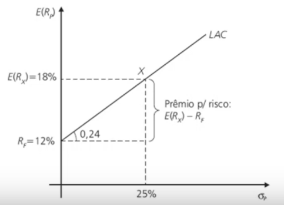

\* Notas feitas sobre o material produzido nas aulas pelo professor Denis Fernando Wolf

# Introdução a Computação no Mercado Financeiro (SSC0964)

## Hipótese do Mercado Eficiente

Amplamente difundida na academia mas com pouca aplicação real prática.

- Os preços de ativos refletem as informações disponíveis, com grande sensibilidade aos dados;
- Desvios nos preços são aleatórios, apresentando igual probabilidade de um ativo encontrar-se sub e supervalorizado;
- Nenhum investidor é capaz de identificar, consistentemente, ativos com preço em desequilíbrio;

Algumas das assertivas assumidas nessa hipótese são:

- Nenhum investidor é capaz de, sozinho, manipular o mercado;
- O mercado é constituído por investidores racionais;
- Todos os participantes do mercado têm acesso a todas as informações ao mesmo tempo;
- Não existe racionamento de capital (sempre existe liquidez nos ativos);
- As expectativas dos investidores são homogêneas;

Percebe-se que boa parte das assertivas não são 100% aplicáveis na prática. Por mais que a hipótese do mercado direcione, muitas vezes, modelos financeiros, os investidores devem identificar as imperfeições do mercado, tentando sempre tirar proveito econômico dos desvios temporários na expectativa que os valores voltem a uma posição de equilíbrio.

Nesse sentido, a tomada de decisão de investidores leva em consideração o _risco estimado_ e a _expectativa de retorno_.

## Retorno e Risco

### Retorno

Representa o ganho ou perda de um investimento. Ao longo de um período de tempo _t_:

$$R_t = \frac{P_t}{P_{t-1}}-1$$

Sendo $R_t$ a taxa de retorno e $P_t, P_{t-1}$ os valores nos períodos $t$ e $t-1$.

### Risco

Pode ser interpretado de diversas maneiras, dependendo do contexto e da pessoa. Pode ser interpretado pelo nível de incerteza associado a um evento.

Pode ser subdividido em:

- _Risco Sistemático_: detiierminado por natureza política, econômica, social;
- _Risco não Sistemático_: identificado nas características de eventos negativos do próprio ativo;

Sendo a incerteza de um investimento entendida como a possibilidade do resultado afastar-se do valor esperado, o _desvio-padrão_ (volatilidade) é geralmente adotado como uma medida de risco, sendo calculado sobre valores discretos.

### Relação Risco Retorno

A preferência de um investidor com relação a risco e retorno pode ser representada por _curvas de indiferença_:

No primeiro caso, o investidor exige retornos muito mais altos conforme o risco aumenta. Já no segundo, o investidor exige um inicial maior, mas menos acentuado conforme o risco aumenta.

No geral, todo investidor buscará o maior retorno possível para um certo nível de risco, ou o menor risco possível para um mesmo patamar de retorno. Essa ideia é baseado no chamado _Princípio da Dominância_.

## Teoria Moderna de Portifólios

Proposta por Harry Markowitz em 1959. Tem o objetivo de maximizar a utilidade (grau de satisfação) do investidor pela relação risco retorno, construindo um portifólio de ativos.

### Retorno de um Portifólio

Dado simplesmente pela média ponderada do retorno esperado de cada ativo em relação à participação total na carteira.

$$E(R_p) = \bar{R_p} = \sum_{j=1}^n R_j * W_j$$

### Volatilidade (Risco) de um Portifólio

**Não é** dada pela média ponderada da volatilidade de cada ativo. Ela **depende da correlação** entre as volatilidades.

Se a correlação é:

- próxima de 1: quando um ativo sobe/desce, o outro também sobe/desce;
- próxima de -1: quando um ativo sobe/desce o outro tem comportamento contrário e desce/sobe (caso mais difícil de acontecer na prática);
- próxima de 0: as volatilidades dos ativos não estão relacionadas.

Portanto, quanto mais ativos presentes no portifólio e quanto menor for a correlação entre eles, _menor é o risco não sistemático_ (de mercado geral).

A volatilidade (desvio padrão) de um portifólio com $n$ ativos é dada por:

$$\sigma_p = \left[ \sum_{i=1}^n \sum_{j=1}^n W_i W_j CORR_{ij} \sigma_i \sigma_j \right]^\frac{1}{2}$$

### Fronteira Eficiente de Markowitz

Combinando os ativos de um portifólio com diferentes pesos, é possível formar, graficamente, uma hipérbole. O segmento após o ponto correspondente ao desvio padrão mínimo da hipérbole é conhecido como _Fronteira Eficiente de Markowitz_, e pode ser utilizado para selecionar uma carteira de investimentos _mais atraente_ (menor risco por retorno) para um investidor.

No exemplo, a Fronteira Eficiente de Markowitz corresponde ao segmento _M-F_.

Se forem combinados mais de 2 ativos, o resultado obtido graficamente será, em vez de uma hipérbole, uma área, sendo a Fronteira Eficiente de Markowitz a "borda superior" da área:

Para determinar qual dos pontos da Fronteira Eficiente de Markowitz é o mais adequado ao investidor, pode-se usar sua _Curva de Indiferença_ correspondente. Nesse sentido o ponto em que a curva de indiferença tangenciar a fronteira pode ser considerado o ponto ideal para a distribuição de pesos entre os ativos, conforme o perfil do investidor.

### Problemas com o Modelo de Markowitz

Apesar da importante e sólida contribuição da Teoria Moderna de Portifólios, alguns pontos negativos podem ser destacados:

- Não existe previsão exata de retorno esperado e variâncias / covariâncias. Estimativas desses valores podem levar a erros;
- O modelo não leva em consideração o peso e disponibilidade de cada ativo no mercado (market cap);
- Não existe quantificação de incerteza quanto ao retorno esperado;
- Modelo instável, pois pequenas alterações nos dados podem mudar drasticamente o portifólio.

## Reta do Mercado de Capitais

A combinação de ativos com risco com ativos livres de risco é dada pela _Linha de Alocação de Capitais (LAC)_.

Exemplo para 2 ativos (X com $E(R_X) = 18\%, \sigma_X = 25\%$ e Y com $E(R_Y) = 12\%$):

### Índice Sharpe

Se, em vez de um único ativo com risco, for considerado um portifólio de ativos com risco, é possível associar a _LAC_ à _Fronteira Eficiente de Markowitz_: o ponto de tangência _M_ dará a combinação do portifólio ótimo.

A inclinação da reta supracitada, é determinada pelo _Índice Sharpe_:

$$Sharpe = \frac{E(R_M) - R_f}{\sigma_{R_M}}$$

Numericamente, o índice representa "um prêmio percentual" (retorno adicional) para cada aumento de 1% no risco.

O Índice Sharpe é o índice mais utilizado na prática para determinar a relação risco retorno.

### Ìndice de Sortino

Numericamente, Índice de Sortino é idêntico ao Índice Shrape, mas leva em consideração apenas a volatilidade negativa (retornos negativos).

$$Sortino = \frac{E(R_M) - R_f}{\sigma_{R_{MN}}}$$

### CAPM - Capital Asset Pricing Model

O CAPM é um modelo de precificação de ativos em que é possível apurar a taxa de retorno requerida por investidores com base em condições de risco.

Teoricamente, a carteira com menor volatilidade é aquela com todos os ativos do mercado. Denotando tal carteira por _M_, a equação da _Reta do Mercado de Capitais_ é dada por:

$$E(R_p) = R_f + \frac{(R_M - R_f)}{\sigma_M} \cdot \sigma_p$$

Podemos reescrever tal equação como:

$$E(R_p) = R_f + \frac{\sigma_p}{\sigma_M} \cdot (R_M - R_f) = R_f + \beta_p \cdot (R_M - R_f)$$

sendo $\beta_p = COV_{R_p,R_M} / VAR_M$ (a sensibilidade do portifólio em relação à carteira do mercado).
Para o fator $\beta$ de um portifólio de vários ativos:

$$\beta_p = \sum_{i=1}^n \beta_j W_j$$

A interpretação de $\beta$ é:

- $\beta = 1$: risco do ativo = risco da carteira do mercado (o ativo acompanha o mercado);
- $\beta > 1$: risco do ativo > risco da carteira do mercado (em altas/baixas do mercado a valorização/desvalorização é maior);
- $\beta < 1$: risco do ativo < risco da carteira do mercado (em altas/baixas do mercado a valorização/desvalorização é menor);
- $\beta < 0$: comportamento contrário ao mercado;

#### O Componente $\alpha$ de Jansen

Se o retorno de um portifólio difere do retorno calculado pelo CAPM, pode ser considerado o componente $\alpha$ de Jansen, o qual representa um prêmio real associado ao risco (como se fosse o termo independente na equação de uma reta).

Ao longo prazo, segundo a Hipótese do Mercado Eficiente, o coeficiente $\alpha$ tende a 0, por conta da arbitragem do mercado.

Em casos em que o ativo livre de risco é bem comportado ou próximo de 0, a alocação ativa é dada por:

$$R_p \approx \alpha_p + \beta R_M$$

Como $E(\alpha) = 0$, a alternativa é selecionar o portifólio pelos valores de $\beta$:

- Se alta no mercado prevista: selecionar ativos com $\beta$ próximo de 1;
- Se baixa no mercado prevista: selecionar ativos com $\beta$ próximos de 0 ou -1;

Nesse sentido, existe um confronto de pensamento entre alguns investidores e a Hipótese do mercado Eficiente: alguns investidores acreditam ser possível prever o comportamento do mercado e acreditam também ser possível obter $\alpha$, enquanto a
HME não assume tais possibilidades e, seguindo as teorias, a melhor alternativa seria seguir o mercado, com o menor custo possível.

O primeiro grupo segue a chamada _alocação ativa_ (alocação em ativos "promissores"), enquanto o segundo a _alocação passiva_ (acompanha os índices de mercado).

### Portifólio de Máxima Utilidade

Em vez de considerar o retorno sobre volatilidade, o Portifólio de Máxima Utilidade considera:

$$argmax_w: E(R_p - R_f) - \lambda\sigma_p^2$$
$$argmax_w: w^\top E(\mu - R_f) - \lambda w^\top C w$$

sendo $$

### Índice de Treynor

Pode ser utilizado como alternativa ao Índice Sharpe e de Sortino. O Índice de Treynor relaciona o índice $\beta$ da carteira, expressão de seu risco sistemático:

$$Treynor = \frac{E(R_p) - R_f}{\beta}$$

## Análise Fundamentalista

Contrária à Análise Técnica, que prioriza buscar padrões na movimentação de preços para tirar proveito da variação, principalmente no curto prazo com _investimentos especulativos_.

A Análise Fundamentalista leva em conta a análise financeira da empresa (receita, fluxo de caixa, impostos, balanços patrimoniais, perspectiva de crescimento do nicho, etc).

Pode ser feita de 2 formas:

- _Top-Down_: análise econômica -> análise setorial -> análise da empresa;
- _Bottom-Up_: análise da empresa -> análise setorial -> análise econômica.

Alguns dos principais passos da análise fudamentalista são:

- Conhecer bem o setor de atuação da empresa (o setor está aquecido / tem perspectia de crescimento?);
- Entender profundamente o negócio da empresa (quais os diferenciais em relação à concorrência?);
- Projetar os resultados da empresa (resultados passados são bons? existe capacidade de expansão?);
- Estimar o preço justo da empresa - valuation;
- Decidir quais empresas formarão o portifólio.

### Métodos de Valuation

#### Fluxo de Caixa Descontado

- É o método mais utilizado no Mercado Financeiro;
- Valor da empresa é a soma do fluxo de caixa previsto ao longo do tempo;
  - Valor do dinheiro no tempo: $VF = VP \cdot (1 + r)^t$, sendo $r$ a taxa de desconto;
  - Valor presente líquido: $VPL = \sum_t \frac{FC_t}{(1 + r)^t}, FC$ fluxo de caixa;
  - A estimativa de todos os parâmetros do fluxo de caixa é uma tarefa complexa, que exige enorme conhecimento sobre a empresa, seu setor e economia;
- Nunca será possível prever com exatidão o preço justo do ativo, mas o método é útil para identificar possíveis distorções do preço esperado.

#### Modelo de Gordon

- Modelo mais simples;
- Valor da empresa é a somas dos dividendos pagos ao acionista ao longo do tempo;
  - $VPL_0 = \frac{D_0 (1 + g)}{r - g} = \frac{D_1}{r-g}, r$ taxa de retorno requerida e $g$ taxa de crescimento de dividendos;
- Só funciona para empresas que pagam dividendos recorrentemente;

#### Análise de Múltiplos

- O múltiplo "justo" pode ser definido pela comparação de indicaores com pares do mesmo segmento ou com o histórico da empresa;
- Exemplos de indicadores:

  - DY: dividend yield $\uparrow$ melhor;
  - P/L: preço / lucro $\downarrow$ melhor;
  - P/VP: preço / valor patrimonial $\downarrow$ melhor;
  - ROIC: retorno sobre capital investido $\uparrow$ melhor;
  - ROE: retorno sobre patrimônio líquido $\uparrow$ melhor;
  - EV/EBIT: valor da firma / lucro operacional (se aproxima do P/VP) $\downarrow$ melhor;
  - EV/EBITDA: valor da firma / lucro operacional - depreciação e amortizações (se aproxima do P/VP) $\downarrow$ melhor;
  - DL/EBITDA: dívida líquida / lucro operacional - depreciação e amortizações $\downarrow$ melhor;
  - CAGR Receita: crescimento da receita $\uparrow$ melhor;
  - CAGR Lucro: crescimento do lucro $\uparrow$ melhor;

- Se uma empresa negocia um múltiplo muito diferente do seu par, os múltiplos deveriam convergir.

## Factor Investing

Na prática, o CAPM "explica" 66% dos preços dos ativos.

O Factor Investing utiliza _modelos quantitativos_ e é uma estratégia na qual a carteira é montada **com base em fatores (não em empresas)**, os quais, em tese, ajudam a reconhecer ativos com retorno acima do mercado.

Existem 2 tipos de fatores que geram retorno:

- Fatores macroeconômicos: capturam riscos amplos por várias classes de ativos;
- Fatores de estilo (específicos): ajudam a explicar retornos dentro de classes de ativos.

Ao longo da história, foram propostos vários modelos de fatores:

- Modelo de 1 Fator (1964): proposto por Willian Sharpe (CAPM). O mercado influencia nos resultados dos ativos. Considera o fator $\beta$;
- Modelo do Fator Tamanho (1981): proposto por Rolf Banz. Small Caps tem um potencial de crescimento muito maior que empresas consolidadas, mas o risco de investimento nessas empresas também é maior;
- Modelo do Fator Momentum (1993): proposto por Sheridan Titman. Empresas que tiveram um resultado recente positivo, tendem a manter esse resultado;
- Modelo de 3 Fatores (1993): proposto por Fama e French. Considera a união dos 3 modelos supracitados;

Existem muitos mais modelos no Factor Investing, mas o Modelo de 3 Fatores obteve uma adoção mais consolidada.

### Modelo de 3 Fatores

A equação do modelo de 3 fatoes é dada por:

$$R_i = \alpha_i + R_f + \beta_i (R_M-R_f) + s_i SMB + h_i HML$$

onde $\alpha_i$ é o alfa de Jansen, $SMB$ é o prêmio de tamanho (Small Minus Big), $HML$ é o prêmio de valor (High VP/P Minus Low VP/P).

O modelo dee 3 fatores "explica" 90% dos preços dos ativos.

### Exemplos de Fatores

#### Fator Valor

- HML (High Minus Low);
- Exemplos de indicadores do fator:
  - P/L;
  - P/VP;
  - EV/EBIT;
  - EV/EBITDA.

#### Fator Tamanho

- SMB (Small Minus Big);
- Indicador usado pelo fator:
  - Valor de Mercado.

#### Qualidade

- QMJ (Quality Minus Junk);
- Exemplos de indicadores do fator:
  - ROE;
  - ROIC;
  - DL/EBITDA;
  - CAGR Lucro;
  - CAGR Receita;

#### Volatilidade

- LVMHV (Low Volatility Minus High Volatility)
- Exemplos de indicadores do fator:
  - Volatilidade semestral;
  - Volatilidade anual;

#### Fator Momentum

- UMD (Up Minus Down)
- Exemplos de indicadores do fator:
  - Rentabilidade semestral;
  - Rentabilidade anual;

### Portifólios Multifatores

Combinam características de vários fatores com o intuito de se beneficiar com o retorno dos ativos em diferentes cenários.

#### Estratégias para Formação do Portifólio

- Combinação: ações são ranqueadas em cada fator e posteriormente combinadas;
- Seleção Sequencial: ações são ranqueadas e selecionadas em cada fator sequencialmente (funciona como um filtro);
- Intersecção: ações são avaliadas no conjunto de fatores de acordo com um ranking para cada fator e os melhores são selecionados;
- Soma de Fatores: os fatores são somados com determinada pontuação e posteriormente ranqueados.

### Otimização de Portifólios

Como fazer a ponderação de ativos dentro de um portifólio?

O _Effective Number of Constituents_ dá o número efetivo de elementos do portifólio:

$$ENC = \frac{1}{\sum_{i=1}^Nw_i^2}$$
