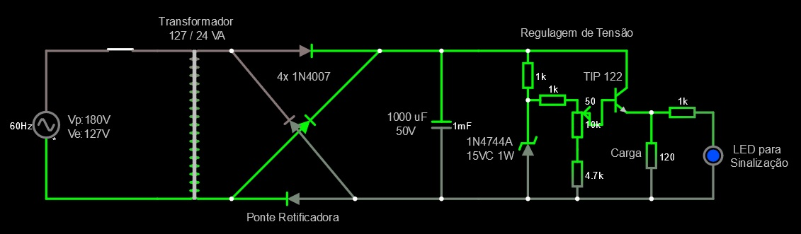

# Fonte de Tensão Ajustável de 3V a 12V com Capacidade de 100mA

## Diagrama do Circuito

* [Link](http://www.falstad.com/circuit/circuitjs.html?cct=$+1+0.000005+11.086722712598126+43+5+43%0AT+48+368+144+560+0+4+0.2149+-0.1396123392207948+4.7714610040827665e-12+0.999%0Av+-96+368+-96+560+0+1+60+179.60512240002845+0+0+0.5%0Aw+-96+560+48+560+0%0Ar+688+448+688+560+0+120%0Ad+144+368+336+368+2+default%0Ac+416+368+416+560+0+0.001+36.88072539993128%0Ad+144+560+336+368+2+default%0Ad+304+560+144+560+2+default%0Ad+304+560+144+368+2+default%0Aw+528+560+464+560+0%0Aw+528+368+464+368+0%0As+-16+368+16+368+0+0+false%0Aw+-16+368+-96+368+0%0Aw+16+368+48+368+0%0At+624+432+656+432+0+1+-23.939987908288614+0.7174184659413356+100%0Aw+656+368+656+416+0%0Aw+656+448+688+448+0%0Aw+688+560+592+560+0%0Aw+624+464+608+464+0%0Aw+624+432+624+464+0%0Ar+528+368+528+432+0+1000%0Aw+656+368+528+368+0%0A34+zvoltage%5Cq15+0+1.7143528192810002e-7+0+2+15%0Az+528+560+528+432+2+zvoltage%5Cq15%0Aw+592+560+528+560+0%0Ar+592+496+592+560+0+4700%0Aw+336+368+416+368+0%0Aw+304+560+416+560+0%0A162+768+448+768+560+2+default-led+0+0.3+1+0.01%0Ar+688+448+768+448+0+1000%0Aw+688+560+768+560+0%0Ar+528+432+592+432+0+1000%0A174+592+432+592+480+1+10000+0.005+Resistance%0Ax+38+335+150+356+4+15+%5Cs%5Cs%5CsTransformador%5Cs%5C%5Cn%5Cs%5Cs%5Cs%5Cs%5Cs%5Cs127%5Cs/%5Cs24%5CsVA%0Ax+-68+463+-14+484+4+15+Vp:180V%5C%5CnVe:127V%0Ax+159+589+287+592+4+15+%5CsPonte%5CsRetificadora%5Cs%0Ax+203+407+272+410+4+15+4x%5Cs1N4007%0Ax+345+441+402+480+4+15+%5C%5Cn1000%5CsuF%5Cs%5C%5Cn%5Cs%5Cs%5Cs50V%0Ax+635+506+675+509+4+15+Carga%0Ax+518+350+664+353+4+15+Regulagem%5Csde%5CsTens%C3%A3o%0Ax+790+501+865+522+4+15+%5CsLED%5Cspara%5Cs%5C%5CnSinaliza%C3%A7%C3%A3o%0Ax+448+491+511+512+4+15+1N4744A%5C%5Cn15VC%5Cs1W%0Aw+416+560+464+560+0%0Aw+416+368+464+368+0%0Ax+600+407+650+410+4+15+TIP%5Cs122%0Ao+1+64+0+4099+320+0.8+0+2+1+3%0Ao+5+64+0+4099+80+3.2+1+2+5+3+Capacitor%0Ao+22+64+0+4099+20+0.05+2+2+22+3+Diodo%5CsZener%0Ao+3+64+0+4099+20+0.2+3+2+3+3+Carga%0A) para a simulação no Falstad

