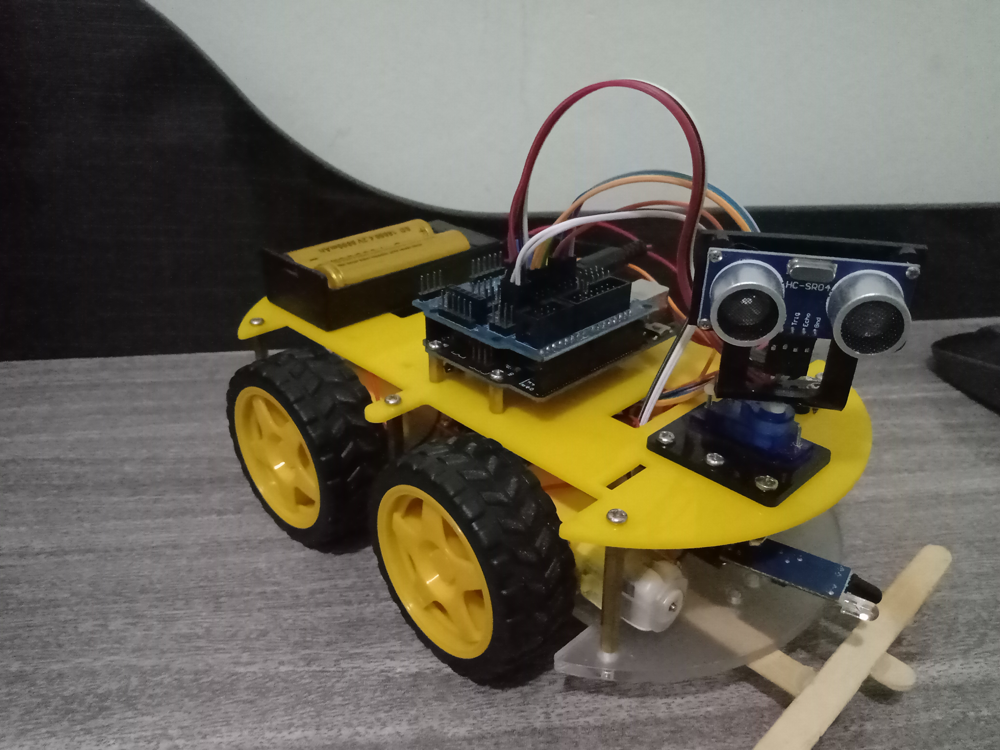
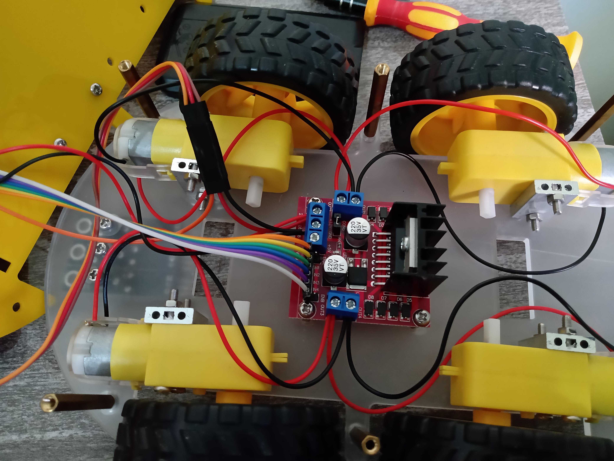

<h1> Carrinho que desvia de Obstáculos

<h2> Componentes Utilizados: </h2>
<ul>
<li><b>1 x Arduino Uno:</b> é o "cérebro" do carro. Uma placa com pinos de entrada e saída programada para tomar decisões com base em valores lidos por sensores;</li> 
<li><b>1 x Sensor Ultrassônico:</b> através de seus pinos "Trig" e "Echo", são emitidas ondas ultrassônicas que permitem aferir distâncias entre 2cm e 4m;</li>
<li><b>1 x Sensor de Obstáculos Infravermelho:</b> sensor com um único pino de sinal, que comuta seu estado quando detecta um obstáculo. A distância mínia para comutação pode ser ajustada por um potenciômetro presente no sensor;</li>
<li><b>1 x Servo Motor:</b> motor que varia seu ângulo de 0 a 179 graus. Serve de suporte ao sensor ultrassônico para que o carro "olhe para os lados" quando detectar uma possível colisão;</li>
<li><b>4 x Motores DC:</b> mini motores com caixas de redução que são acoplados às rodas do carro;</li>
<li><b>Ponte H:</b> módulo que permite o controle da velocidade e do sentido da rotação dos motores;</li>
<li><b>2 x Pilhas Recarregáveis de 3.7V</b> São a fonte de energia elétrica do circuito de controle (formado pelo Arduino e Sensores) e do circuito de força (servo motor e micro motores).</li>
</ul>
 

 
